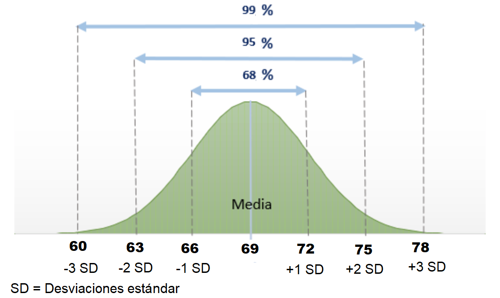

# Estadística Inferencial: Introducción

## Antecedentes relevantes

### La desviación estándar

-   La desviación estándar es una parte integral de la estadística inferencial y entender su funcionamiento nos ayudará a utilizarla más adelante.

-   Recuerda, la desviación estándar es la raíz cuadrada de la sumatoria de todas las diferencias entre los valores observados y su media.

$$\sigma = \sqrt{\frac{1}{N}\sum_{i=1}^{N}(x_i - \mu)^2}$$ 

- La desviación estándar se llama "estándar" porque **proporciona una unidad de medida común** para comparar unidades observadas de medida muy diferente. Ejemplo: imaginemos que tenemos la variable ingreso que tiene media 120 y desviación estándar 10 y deseamos analizar el caso X = 130.

| Forma de puntuación        | Fórmula                         | Ejemplo   |
|----------------------------|---------------------------------|-----------|
| Puntuación en bruto        | $$X$$                           | 130 soles |
| Puntuación de desviación   | $$X - \bar{X}$$                 | 10 soles  |
| Puntuación estandarizada Z | $$Z = \frac{X - \bar{X}}{S_X}$$ | 1 SD      |

> Presta atención a las unidades de medida!

-   En el ejemplo anterior podemos corroborar que nosotros podemos medir la lejanía de una observación respecto a su media, no sólo en las unidades originales, sino diciendo **cuántas desviaciones estándar** la separa de su media. Está última medida se conoce como puntuaciones Z y es muy útil para comparar niveles de dispersión de variables observadas.

-   Algunas reglas: 1) mientras más lejana esté una observación de su media, mayor será su puntuación de desvación y su puntuación Z. 2) El signo de la puntuación Z indica si la observación está por debajo o por encima de la media.

### La distribución (curva) normal y las SD

-   Anteriormente te comenté que la curva normal (forma de campana) ejercía un rol fundamental en el contexto de la estadística inferencial. Esto es gracias a una propiedades muy interesantes.

-   La principal: cuando una variable tiene distribución de puntuaciones que es normal (casi) la totalidad de observaciones están distribuidas +- 3 desviaciones estándar (puntuaciones Z) respecto de su media.


-   Este principio matemático sienta las bases de la imaginación estadística, dado que muchos fenómenos naturales poseen distribuciones de frecuencias en forma de campana como la curva normal.

-   Como se ve en la figura, son 4 los principios: 1) 50% de las puntuaciones caen encima de la media y 50% debajo; 2) Prácticamente todas las puntuaciones caen dentro de 3 SD a partir de la media en ambas direcciones (en realidad el 99.7%); 3) Cerca del 95% de las puntuaciones de una variable normalmente distribuida caen dentro de una distancia de +- 2 SD respecto de la media; y 4) Alrededor del 68% de las puntuaciones caen dentro de una distancia de +-1 SD respecto de la media.

## Elementos básicos de probabilidad

### Conceptos

-   Probabilidad: Análisis y comprensión de las ocurrencias (de eventos) por el azar. Más específicamente, es un detalle de con qué frecuencia es probable que ocurra un evento de interés particular entre un gran número de ensayos.

-   La fórmula general para presentar una probabilidad es:

$$P(\text{éxito}) = \frac{\text{# de éxitos}}{\text{# de ensayos}}$$

-   Existen diversas reglas básica de la teoría de la probabilidad. Te recomiendo leer las páginas 172 - 176 de Ritchey (2006).

### Curva normal y probabilidades

-   En probabilidades hay un principio que utiliza el concepto de la curva normal que hemos explicado anteriormente. Dada cierta variable que se distribuye normalmente, podemos calcular puntuaciones estándarizadas (puntuaciones Z) y usarlas de tal forma que calculas el **número de puntuaciones que cae entre dos puntos en la distribución**.

-   Veamos nuevamente la curva. Ahora, dependiendo las puntuaciones Z que elijamos vamos a hacer un cálculo de qué porcentaje de puntuaciones se encuentran **bajo la curva**. Dicho de en otras palabras, vamos a examinar el **área bajo la curva**.

-   En este sentido, el área bajo la curva representa probabilidades de ocurrencia. Veamos el siguiente ejemplo, donde tenemos el promedio de edad en una población de estudio (X=69) con desviación estándar 3 (SD=3).



Con este ejemplo, para el intervalo de 66 - 72 podemos afirmar lo siguiente:

-   La proporción de casos entre estos dos puntos es 68%.

-   El área bajo la curva entre estas dos puntuaciones es 68%.

-   La probabilidad de seleccionar al azar un caso entre estas dos puntuaciones es 68%.

## Ejemplo con R

-   Usted tiene la siguiente variable con distribución normal, de media 100 y desviación estándar 20.

```{r}
media <- 100
desviacion_estandar <- 20
variable_aleatoria <- rnorm(n = 1000, mean = media, sd = desviacion_estandar)
summary(variable_aleatoria)
```

-   Visualicemos si tiene la curva normal.

```{r}
library(tidyverse)
variable_aleatoria |> 
  data.frame() |> 
  ggplot() +
  aes(x=variable_aleatoria) + 
  geom_density()
```

-   Comprobemos la teoría. Pintemos las líneas de -1 SD, -2 SD, -3SD, la media, +1 SD, +2 SD y +3SD. Recuerda que la desviación estándar es 20.

```{r echo=FALSE}
variable_aleatoria |> 
  data.frame() |> 
  ggplot() +
  aes(x=variable_aleatoria) + 
  geom_density() +
  geom_vline(xintercept = c(40, 60, 80, 100, 120, 140, 160), linetype = "dashed", color = "red") 

```

Cuánto porcentaje de casos se encuentran entre 80 (-1SD) y 120 (+1SD)?

```{r}
variable_aleatoria |> 
  data.frame() |> 
  filter(variable_aleatoria>=80, variable_aleatoria<=120) |> 
  count() |> 
  mutate(p=n/1000)
```

-   Y de 60 a 140?

```{r}
variable_aleatoria |> 
  data.frame() |> 
  filter(variable_aleatoria>=60, variable_aleatoria<=140) |> 
  count() |> 
  mutate(p=n/1000)
```

## Elementos básicos de la inferencia

### Definiciones preliminares

-   La estadística inferencial utiliza la muestra de datos para hacer estimaciones y tomar decisiones acerca de las características de una población. Esto implica la utilización de técnicas y métodos para inferir información sobre la población a partir de la información recopilada en la muestra.

-   Algunas definiciones básicas:

| Definición  | Descripción                                                                                                                                                                                                                                                          |
|------------------------------------|------------------------------------|
| Población   | Se refiere al conjunto total de individuos, objetos, eventos, medidas o cualquier otra cosa que se quiera estudiar. En estadística inferencial, la población se utiliza como el objeto de estudio, y se busca inferir información sobre ella a partir de la muestra. |
| Muestra     | Es un subconjunto de la población que se utiliza para hacer inferencias sobre la población en su conjunto. La selección de la muestra debe hacerse de tal forma que represente de manera adecuada las características de la población.                               |
| Estadístico | Es una medida numérica que se utiliza para resumir o describir alguna característica de la muestra. Los estadísticos se calculan a partir de los datos de la muestra y se utilizan para hacer inferencias sobre los parámetros de la población.                      |
| Parámetro   | Es una medida numérica que describe alguna característica de la población. En estadística inferencial, el objetivo es hacer inferencias sobre los parámetros de la población a partir de los datos de la muestra.                                                    |

### Estimación puntual

Imaginemos que tenemos una población de 45 individuos. A cada uno se le ha preguntado acerca de cuántas veces han asistido a una manifestación, marcha o evento público en los últimos 3 años. La data es la siguiente:

```{r}
poblacion<- c(1,1,1,1,1,1,2,2,2,2,2,2,2,2,2,2,2,2,2,2,2,2,2,3,3,3,3,2,2,2,2,4,4,4,4,4,4,4,4,5,5,5,5,5,5)
length(poblacion)
```

-   Veámoslo gráficamente.

```{r}
poblacion=as.data.frame(poblacion)
poblacion |> 
  ggplot()+
  aes(x=poblacion) |> 
  geom_bar()
```

-   Como dato previo sabemos que en esta población la media es de 2.71. Ojo, normalmente nosotros no sabemos cuál es el parámetro poblacional, sólo lo planteamos así con fines didácticos.

```{r}
mean(poblacion$poblacion)
```

-   Ahora vamos a hacer un estudio inferencial a partir de una muestra de 5 personas (n) para calcular la media poblacional (parámetro). Primero hay que preguntarnos, cuántas muestras posibles existen para 50 distintos elementos? No son pocas.

```{r}
n_muestras = choose(50, 5)
n_muestras
```

-   Ok, elijamos una muestra aleatoria. Utilicemos la tabla de números aleatorios (el antepasado del famoso set.seed() de R). Si no es legible, puedes entrar en este [link](https://www.studocu.com/latam/document/universidad-de-el-salvador/estadistica-i/tabla-de-numeros-aleatorios/12886081)

 - Elijamos una muestra de 5 casos según la tabla de números aleatorios, es decir, los casos: 10, 22, 24, 42 y 37.

```{r}
muestra1= poblacion[c(10, 22, 24, 42, 37),]
muestra1
```

-   Calculemos la media muestral (estadístico):

```{r}
mean(muestra1)
```

-   Según la muestra que hemos calculado, hemos obtenido una media de 3.2. Si nosotros nos quedamos sólo con ese valor entonces estamos eligiendo una estimación puntual.

> ESTIMACIÓN PUNTUAL: Estadístico proporcionado sin **indicar un rango de error**.

### Error de muestreo

Si nosotros hacemos este ejercicio una y otra vez, es decir seleccionamos varias muestras, probablemente obtengamos resultados diferentes. Cada media muestral es ligeramente mayor o menor que la anterior.

```{r}
muestra2= poblacion[c(4, 23, 41, 21, 45),]
muestra2
```

```{r}
mean(muestra2)
```

-   Esto quiere decir que los estadísticos muestrales no son los valores exactos de parámetros poblacionales. Son muchas las posibilidades de que obtengas medias muestrales ligeramente diferentes.

-   Aquí los teóricos descubrieron un principio: cuando uno realiza muestreos repetidos y calcula sus respectivos estadísticos, los valores **tendían a agruparse alrededor de un valor particular, el cual sería el verdadero parámetro poblacional**.

### Distribuciones de muestreo.

-   Ahora bien, ya sabemos que podemos solicitar varias muestras. Qué distribución tendrían todas las medias que calculemos en un determinado número de muestras?

-   Calculemos 100 000 muestras para el vector de nuestra población y calculemos la media de cada uno en una tabla. Para ello, le pedimos ayuda al R.

```{r}
poblacion<- c(1,1,1,1,1,1,2,2,2,2,2,2,2,2,2,2,2,2,2,2,2,2,2,3,3,3,3,2,2,2,2,4,4,4,4,4,4,4,4,5,5,5,5,5,5)
muestras <- replicate(100000, sample(poblacion, size=5))
medias <- apply(muestras, 2, mean)
df <- data.frame(media=medias)
```

-   Ahora grafiquemos las medias calculadas.

```{r}
df |> 
  ggplot()+
  aes(x=medias) |> 
  geom_histogram(bins = 10)
```

-   Descubrimos que cuando obtenemos muchas muestras y calculamos sus estadísticos (medias), estan en conjunto adquieren una **distribución normal**. Esto ocurre, a pesar de que la distribución de las puntuaciones originales **no tenía distribución normal**.

> **Una distribución muestral de medias tiene forma normal.**

> **Puesto que una distribución muestral de medias adopta una forma normal se puede calcular la probabilidad de ocurrencia de cualquier resultado muestral**

> **Una distribución muestral nos indica con qué frecuencia un estadístico muestral tiene la probabilidad de fallar respecto al valor real del parámetro poblacional**

### Error estándar

-   Recuerdas que habíamos dicho que en la curva normal se podría evidenciar que la totalidad de las observaciones se encontraban entre -3 y +3 desviaciones estándar respecto de la media? En el caso de las distribuciones muestrales, esa desviación estándar es conocida como **error estándar**.

- El error estándar mide la dispersión del error de muestreo que ocurre cuando se muestrea repetidamente una población (como lo hicimos líneas arriba).

$$s_{\hat{x}} = \frac{s}{\sqrt{n}}$$

Entonces los puntos más importantes del EE son:

- El error estándar es una medida de cuánto se espera que varíen las medias de las muestras tomadas de una población determinada. A medida que el tamaño de la muestra aumenta, el error estándar tiende a disminuir.

- El error estándar es importante en el cálculo de los intervalos de confianza. Cuanto menor sea el error estándar, menor será la variabilidad de las medias muestrales y más preciso será el intervalo de confianza.

- El error estándar se calcula dividiendo la desviación estándar de la población entre la raíz cuadrada del tamaño de la muestra. En la mayoría de los casos, la desviación estándar de la población no se conoce y se utiliza **la desviación estándar de la muestra para estimar el error estándar**.

### Teorema del límite central

- El teorema del límite central (TLC) es uno de los conceptos más importantes de la estadística y es fundamental en el muestreo y la inferencia estadística. 

- En términos simples, el teorema del límite central dice que si tomamos suficientes muestras aleatorias grandes de una población, la distribución de las medias de esas muestras será una distribución normal, sin importar cómo se vea la distribución original de la población.

- Esto es importante en el muestreo porque nos permite hacer inferencias precisas sobre una población, incluso si no conocemos su distribución. **Si podemos asumir que la distribución de la población es aproximadamente normal**, entonces podemos usar la distribución normal de las medias de las muestras para hacer predicciones y estimaciones precisas sobre la población.

- Además, el TLC nos permite calcular intervalos de confianza y realizar pruebas de hipótesis (siguiente secciòn) con mayor precisión, lo que nos permite tomar decisiones más informadas basadas en los datos muestrales. En resumen, el teorema del límite central es una herramienta clave en la inferencia estadística y nos permite hacer generalizaciones precisas sobre una población a partir de datos muestrales.

**Máquina de Galton**

<iframe width="560" height="315" src="https://www.youtube.com/embed/EvHiee7gs9Y" title="YouTube video player" frameborder="0" allow="accelerometer; autoplay; clipboard-write; encrypted-media; gyroscope; picture-in-picture; web-share" allowfullscreen></iframe>

El Tablero de Galton ilustra cómo la distribución de frecuencias de los resultados de muchos eventos aleatorios independientes se acerca a una distribución normal, independientemente de la forma de la distribución original, siempre que el número de eventos sea lo suficientemente grande.

### Ley de los grandes números

- La ley de los grandes números es un teorema en estadística que establece que, a medida que el tamaño de una muestra aumenta, la media muestral se acerca a la media poblacional. En otras palabras, cuando se toman muestras cada vez más grandes de una población, se espera que la media de esas muestras se acerque cada vez más a la media real de la población.

- Esta ley es importante porque permite a los investigadores obtener estimaciones precisas de los parámetros de una población a partir de una muestra relativamente pequeña. Además, esta ley también es fundamental para la teoría de la probabilidad y es utilizada en muchas áreas de la estadística y de la ciencia en general.

> Mientras más grande sea la muestra, la media muestras se acerca a la media poblacional. 


## Intervalo de confianza de una media


- El intervalo de confianza es un rango de valores posibles de un parámetro expresado con un grado específico de confianza. 

- Si tenemos un nivel de confianza de 95% quiere decir que si realizamos 100 veces el mismo procedimiento de muestreo y calculamos los estadísticos de interés, 95 veces nos van a salir resultados en los intervalos calculados. Si lo realizamos con un 99% de confianza, de igual manera, si realizamos 100 veces el procedimiento, 99 veces nos va a salir resultados en el intervalo resultante. Esto lo tenemos claro gracias a la explicación del rol que cumple la curva normal y sus propiedades. 

> A MAYOR CONFIANZA MENOR ES LA PRECISIÓN (LOS INTERVALOS SON MÁS AMPLIOS)

- Para el cálculo de un intervalo de confianza utilizamos la siguiente fórmula. Recuerda 


- Ese valor que se suma y se resta a la media muestral es el **término de error**, sin embargo, es más conocido como margen de error. 

## Ejemplo: ENADES 2022

El Instituto de Estudios Peruanos, por encargo de Oxfam en Perú, elaboró la I Encuesta Nacional de percepción de Desigualdades – ENADES 2022. Este estudio pone a disposición del público el análisis estadístico más completo a la fecha sobre la percepción de las diferentes formas de desigualdad en el Perú.

Además de factores económicos, la presente encuesta incluye indicadores que permiten medir la magnitud de una serie de brechas sociales y políticas: desde diferencias de género, clase y relaciones étnico-raciales, hasta dimensiones subjetivas de la desigualdad y sus vínculos con orientaciones políticas. Como se muestra a lo largo del informe, la base de datos de este proyecto provee herramientas valiosas a expertos de diferentes campos, tanto académicos como profesionales, estudiantes y personas interesadas en el análisis multidimensional de la desigualdad en el país.

Puedes abrir el cuestionario de la encuestas [aquí](https://iep.org.pe/wp-content/uploads/2022/08/Cuestionario-Oxfam-IEP.-ENADES-2022-final.pdf) 

También puedes ver el informe [aquí](https://iep.org.pe/wp-content/uploads/2022/07/I-Encuesta-nacional-de-percepcion-de-desigualdades-ENADES-2022-v2.pdf)

### Abrir base de datos

```{r}
library(haven)
enades<-read_spss("data/ENADES_2022.sav") # Con esta función abrimos archivos de SPSS
# enades<-read_spss("https://github.com/ChristianChiroqueR/banco_de_datos/raw/main/ENADES_2022.sav")
```

### Identificar una variable numérica

Elijamos la variable P17: 

- En una escala del 1 al 10, en la que 1 es “Totalmente inaceptable” y 10 es “Totalmente aceptable”. ¿Hasta qué punto es aceptable la desigualdad en el Perú? Dígame un número de 1 a 10, recuerde que 1 es “Totalmente inaceptable” y 10 es “Totalmente aceptable (RESPUESTA ESPONTÁNEA)

La convertimos en numérica.

```{r}
enades$p17<-as.numeric(enades$p17)
```

Solicitamos los estadísticos descriptivos para darle una primera mirada. 

```{r}
summary(enades$p17)
```

Podemos graficarlo

```{r message=FALSE, warning=FALSE}
enades |> 
  ggplot() + 
  aes(x=p17)+
  geom_bar()
```

### Cálculo del estimador puntual: media muestral

```{r}
mean(enades$p17, na.rm = TRUE)
```

### Cálculo del intervalo de confianza al 95%

Establecemos nuestra información de insumo. 

```{r}
media<-mean(enades$p17, na.rm = TRUE)
SE<- sd(enades$p17, na.rm = TRUE)
z<- 1.96
n <-length(enades$p17)
```

Ahora calculamos el error estándar:

```{r}
errorst <- SE/sqrt(n)
```

Una vez calculado el error estándar podemos calcular los límite superior e inferior. 

```{r}
### Calculamos el límite inferior

lim_inf<- media - (z*errorst)

### Calculamos el límite superior

lim_sup<- media + (z*errorst)

### Creamos el listado de valores para visualizarlo en versión data frame

interval_m <- data.frame(n, media, SE, z, errorst, lim_inf,lim_sup)
interval_m

```

Para verlo mejor podemos utilizar el paquete `kableExtra`:

```{r message=FALSE, warning=FALSE}
library(kableExtra)
interval_m |> 
  kbl() |> 
  kable_styling()
```


También podemos calcularla utilizando una sola función:

```{r}
library(lsr)
ciMean(enades$p17, na.rm = T)
```

### Comparación de IC entre grupos

Primero definamos un grupo de comparación. En este caso necesitamos un factor. Utilizaremos la variable zona3, la cual separa a los encuestados según su procedencia en: Lima Metropolitana y Perú sin Lima. 

Veamos:

```{r}
enades$zona3<-factor(enades$zona3, 
                     levels=1:2, 
                     labels=c("Lima Metropolitana", "Perú sin Lima"))
```

Corroboremos:

```{r}
str(enades$zona3)
```

Solicitemos el intervalo de confianza de la variable p17 para cada grupo identificado:

```{r}
enades %>% 
  group_by(zona3) %>% 
  summarise(mean = mean(p17, na.rm = TRUE),
            ci_lower = ciMean(p17, na.rm = T)[1],
            ci_upper = ciMean(p17, na.rm = T)[2]) |> 
  kbl() |> 
  kable_styling()
```

Según el cálculo, para Lima Metropolitana la media poblacional se encuentra entre 4.09 y 4.62, mientras que para Perú sin Lima se encuentra entre 4.48 y 4.88. 

### Visualización

> Interpretación: Se superponen los intervalos? Posiblemente no exista diferencia a nivel poblacional. 

```{r message=FALSE, warning=FALSE}
library(gplots)
plotmeans(enades$p17~enades$zona3, p=0.95, 
          xlab="Ámbito", ylab="Aceptación desigualdad", 
          main="Gráfico de medias de Aceptación de la desigualdad en el Perú")
```


