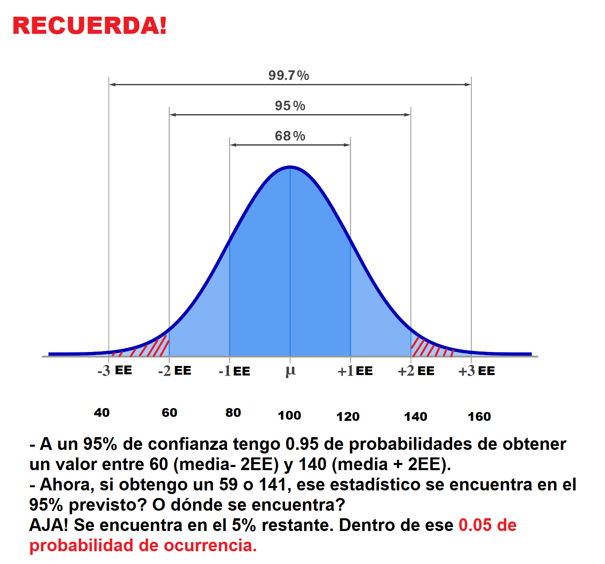
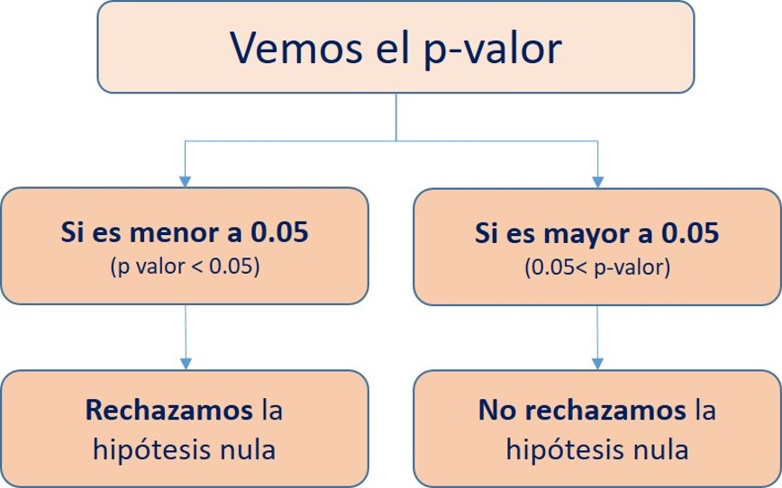

# IC de una proporción e introducción a pruebas de hipótesis

## Recordemos

Abramos los paquetes que vamos a necesitar:

```{r}
library(pacman)
p_load(haven, tidyverse, lsr, kableExtra)

# Esto equivale a:
# library(haven)
# library(tidyverse)
# library(lsr)
# library(kableExtra)

# Es útil cuando necesitamos abrir un gran número de librerías!
```


Continuemos con el ejercicio que vimos en la última clase utilizando la ENADES.

```{r}
enades<-read_spss("data/ENADES_2022.sav") # Con esta función abrimos archivos de SPSS

# Si quiere abrirlo desde GitHub entonces corre la siguiente línea:
# enades<-read_spss("https://github.com/ChristianChiroqueR/banco_de_datos/raw/main/ENADES_2022.sav")
```

Elijamos la variable P17: 

- En una escala del 1 al 10, en la que 1 es “Totalmente inaceptable” y 10 es “Totalmente aceptable”. ¿Hasta qué punto es aceptable la desigualdad en el Perú? Dígame un número de 1 a 10, recuerde que 1 es “Totalmente inaceptable” y 10 es “Totalmente aceptable (RESPUESTA ESPONTÁNEA)

```{r}
enades$p17<-as.numeric(enades$p17) #Lo convertimos a numérica
summary(enades$p17) # Calculamos estadísticos de resumen de forma rápida.
```

### Pasos previos

- Cuál es la variable?

Nivel de aceptación de la desigualdad en el Perú.

- Qué deseamos saber?

Con nuestra muestra deseamos conocer el parámetro poblacional, es decir, la media de aceptación de la desigualdad en la población. 


### Estimación puntual

El estimador puntual es una estadística descriptiva que se utiliza para estimar el valor desconocido de un parámetro poblacional a partir de una muestra. El estimador puntual proporciona una única estimación del valor del parámetro y se calcula a partir de los datos de la muestra.

En este caso, la mejor estimación de la media población es simplemente la media muestral. 

```{r}
mean(enades$p17, na.rm=TRUE) #Calculamos la media, obviando valores perdidos. 
```

### IC para una media

Ahora, una vez identificado el estimador puntual, podemos cambiar nuestra estimación, ahora utilizando intervalos. 

La clase pasada lo hicimos con la fórmula, paso por paso. Ahora, utilizaremos una función: 

```{r}
#library(lsr) #Recuerda que esta función está en el paquete lsr
ciMean(enades$p17, na.rm = T) # Calculamos el intervalo de confianza de p17, obviando valores perdidos. 
```

### IC para una media según grupos

Ahora bien, en la mayoría de casos lo que deseamos es comparar grupos poblacionales. Por ejemplo:

- Quién gana en promedio más dinero, los hombres o las mujeres?

- Quién apoya más, en promedio, a la democracia, los de la zona A o la zona B?

- Entre otros. 

Lo primero que necesitamos para comparar es justamente un grupo de comparación. Ya hablando en programación del R, necesitamos un **factor**. 

Recuerda que el factor era una variable que visualmente son números, pero teóricamente sabemos que cada número es un nivel. 

Utilizaremos la variable zona3, la cual separa a los encuestados según su procedencia en: Lima Metropolitana y Perú sin Lima. 

Veamos:

```{r}
enades$zona3<-factor(enades$zona3, # Nombre de la variable a convertir
                     levels=1:2, # Definimos los niveles (esta variable sólo tenía 2 niveles)
                     labels=c("Lima Metropolitana", "Perú sin Lima")) #Colocamos sus etiquetas

#Con este comando hemos sobreescrito la variable zona3. Ahora lo que inicialmente era una variable numérica, ahora es un factor. 
```

Corroboremos:

```{r}
str(enades$zona3) #Solicitamos la estructura de la variable zona3
```

Solicitemos el intervalo de confianza de la variable p17 para cada grupo identificado:

```{r}
p17_segun_zona<-enades %>% 
  group_by(zona3) %>% #Agrupamos por zona
  summarise(mean = mean(p17, na.rm = TRUE), #Utilizamos summarise y pedimos la media,
            ci_lower = ciMean(p17, na.rm = T)[1], # También el PRIMER ELEMENTO de la función ciMean
            ci_upper = ciMean(p17, na.rm = T)[2]) #Y el SEGUNDO ELEMENTO de la función ciMean
```

```{r}
p17_segun_zona
```


Según el cálculo, para Lima Metropolitana la media poblacional se encuentra entre 4.09 y 4.62, mientras que para Perú sin Lima se encuentra entre 4.48 y 4.88. 

### Barras de error

En el contexto de intervalos de confianza, las barras de error se utilizan para representar el nivel de incertidumbre en una estimación puntual del parámetro poblacional. Un intervalo de confianza es un rango de valores plausible para el valor del parámetro poblacional, y se construye a partir de una muestra aleatoria y un nivel de confianza específico.

Las barras de error en un gráfico de intervalos de confianza se construyen a partir de los límites superior e inferior del intervalo de confianza. Generalmente se dibujan líneas verticales que se extienden desde el valor estimado del parámetro (que puede ser una media, una proporción, una diferencia de medias, etc.) hasta los límites del intervalo de confianza.

Por ejemplo, si se estima la media de una variable a partir de una muestra y se desea construir un intervalo de confianza al 95%, las barras de error se construirán a partir del límite inferior y superior del intervalo de confianza, que contendrán el verdadero valor de la media poblacional con una probabilidad del 95%.

Las barras de error en un gráfico de intervalos de confianza pueden ser útiles para comparar la precisión de las estimaciones entre diferentes grupos o condiciones. Si las barras de error son muy pequeñas, esto sugiere que la estimación es muy precisa y que hay una alta confianza en la validez del intervalo de confianza. Por otro lado, si las barras de error son grandes, esto sugiere que la estimación es menos precisa y que hay una mayor incertidumbre en el intervalo de confianza.

Podemos utilizar un comando básico como la función `plotmeans()`:

```{r message=FALSE, warning=FALSE}
library(gplots)
plotmeans(enades$p17~enades$zona3, p=0.95, 
          xlab="Ámbito", ylab="Aceptación desigualdad", 
          main="Gráfico de medias de Aceptación de la desigualdad en el Perú")
```

Sin embargo, te recomiendo utilizar `ggplot()`!

```{r}
p17_segun_zona |> #Data
  ggplot()+       #Iniciamos el ggplot. A partir de ahora son +! ya no |>!
  aes(y=mean, x=zona3)+  #Los grupos en el eje X y la media en el eje Y
  geom_errorbar(aes(ymin=ci_lower, ymax=ci_upper), width=0.2)+ #Graficamos la barra de error
  geom_text(aes(label=paste(round(mean, 2))), vjust=0, size=5)+ #Colocamos el texto del valor de la media
  xlab("Procedencia") + #Etiqueta del eje X
  ylab("Nivel de aceptación de la desigualdad") # Etiqueta del eje y
```

> Una guía: Se superponen los intervalos?  

Si los intervalos de confianza se superponen significa que no hay una diferencia estadísticamente significativa entre las estimaciones correspondientes a cada intervalo. Es decir, la diferencia entre las estimaciones no es lo suficientemente grande como para ser considerada significativa desde un punto de vista estadístico.

**IMPORTANTE!!**

**Es importante tener en cuenta que la superposición de los intervalos de confianza no es una prueba concluyente de que no hay una diferencia significativa entre las estimaciones. Se debe realizar una prueba de hipótesis para determinar si la diferencia es estadísticamente significativa o no. Sin embargo, la superposición de los intervalos de confianza puede ser una indicación inicial de que la diferencia no es significativa y que no se debe buscar más evidencia.**


### Ahora hazlo tú!

Cree un .Rmd y realice lo siguiente:

Utilizando la variable monto mínimo mensual que requiere su hogar para vivir (P08).

Calcule:

- Brinde el estimador puntual de la media poblacional. 

- Calcule el intervalo de confianza de la media poblacional. 

- Calcule los intervalos de confianza de la media según si el individuo vive en el área urbana o rural (area2). En otras palabras, compare la media de la variable en esos dos grupos. 

- Realice un gráfico de barras de error. Existe indicio de DIFERENCIA entre los dos grupos?

> Tienes 15 minutos!


## Intervalo de una proporción

### Definición

En estadística, el intervalo de una proporción es un rango de valores posibles para la proporción de una característica en una población, que se estima a partir de una muestra aleatoria de la población. Al igual que con la media, el intervalo de una proporción se construye utilizando un nivel de confianza específico y se utiliza para determinar la precisión de la estimación de la proporción en la población.

Por ejemplo, si se desea estimar la proporción de personas en una población que votará por un candidato específico, se puede seleccionar una muestra aleatoria de la población y estimar la proporción de personas que votarán por ese candidato en la muestra. A partir de esta estimación, se puede construir un intervalo de confianza que contendrá el valor real de la proporción en la población con un cierto nivel de confianza.

El ancho del intervalo depende del tamaño de la muestra y del nivel de confianza especificado. A medida que el tamaño de la muestra aumenta, el intervalo se estrecha y se vuelve más preciso. Del mismo modo, a medida que se aumenta el nivel de confianza, el intervalo se amplía y se vuelve menos preciso.

El intervalo de una proporción es una herramienta útil en la inferencia estadística, ya que permite a los investigadores cuantificar la incertidumbre en una estimación de la proporción y determinar si una diferencia entre dos proporciones es estadísticamente significativa.


### Fórmula

> Recuerda que en este caso, al igual que en la media, todo gira en torno a los principios de la curva normal, el número de desviaciones estándar/errores estándar a la izquierda y a la derecha, el teorema central del límite y la ley de los grandes números. Si alguno de estos conceptos no están claros, te recomiendo regresar a la sesión 4 y repasarlos!

Para calcular el intervalo de confianza de una proporción variamos un poco la fórmula que ya conocemos hasta ahora.

Primero hay que tener en cuenta que cuando calculamos la proporción, nos estamos refiriendo específicamente a la proporción de **UNA CATEGORÍA** de una variable **CATEGÓRICA**. Hago el énfasis en ello porque siempre se genera la confusión de "a qué le estoy calculando la proporción". 

Dicho de otra manera, nosotros debemos poner el ojo en una categoría de una variable nominal/ordinal al principio de este cálculo. 


$$\text{Intervalo de confianza para una proporción: } \hat{p} \pm z \sqrt{\frac{\hat{p}(1-\hat{p})}{n}}$$

Donde:

$\hat{p}$ = Proporción muestral de la categoría elegida

z = Puntuación crítica dependiendo de nuestro nivel de confianza elegido


$\sqrt{\frac{\hat{p}(1-\hat{p})}{n}}$ = Error estándar de una proporción


### IC de proporción con la fórmula

Primero ubiquemos una variable categórica. Utilicemos la p11.1:

¿Qué tan desigual es el acceso de los peruanos a la EDUCACIÓN?
1. Muy desigual
2. Poco desigual
3. Nada desigual

```{r}
#Configuramos nuestra variable como factor
enades$p11.1<-factor(enades$p11.1, # Nombre de la variable a convertir
                     levels=1:3, # Definimos los niveles (esta variable sólo tenía 2 niveles)
                     labels=c("Muy desigual", "Poco desigual", "Nada desigual")) #Colocamos sus etiquetas
```


La muestra se divide entre estas tres opciones. Ahora elegimos **UNA CATEGORÍA** de estas tres a la que vamos a calcular la proporción. En este caso vamos a elegir la proporción de individuos que afirmó que el acceso a la educación en el Perú es "Muy desigual".


```{r}
#Calculamos p
enades |> 
  count(p11.1) |> 
  mutate(p=n/sum(n))
```

Ahora sabemos que nuestro $\hat{p}$ = 0.59


```{r}
p<-0.5961
```

El número total de casos es:

```{r}
n<- 1530
```


Ahora definimos la puntuación crítica. Cuánto era para 95% de confianza?

```{r}
z<-1.96
```

Ahora el error estándar $\sqrt{\frac{\hat{p}(1-\hat{p})}{n}}$

```{r}
error_estandar<- sqrt((p*(1-p))/n)
```

Nuestro límite inferior es la proporción muestral menos z*error estándar:

```{r}
limite_inferior<- p-z*error_estandar
limite_inferior
```
Y el límite superior es la proporción muestral más z*error estándar:

```{r}
limite_superior<- p+z*error_estandar
limite_superior
```

Lo podemos colocar todo en un data frame

```{r}
resultados<-data.frame(p, error_estandar, limite_inferior, limite_superior)
resultados |> 
  kbl() |> 
  kable_styling()
```


### IC de proporción con `prop.test()`

Ahora bien, también podemos utilizar la función `prop.test()`:

Recordemos:

```{r}
enades |> 
  count(p11.1) |> 
  mutate(p=n/sum(n))
```

Colocamos la **frecuencia** de la categoría elegida y el tamaño total de la muestra. 

```{r}
prop.test(912, 1530)$conf.int
```

> Por qué colocamos frecuencia? Porque así está configurada esta función. 


### IC de proporción según grupos

Ahora comparemos la proporción elegida (aquellos que creen que el acceso de los peruanos a la EDUCACIÓN es MUY DESIGUAL) entre el sector rural y urbano (area2).

```{r}
enades$area2<- factor(enades$area2, # Nombre de la variable a convertir
                     levels=1:2, # Definimos los niveles (esta variable sólo tenía 2 niveles)
                     labels=c("Urbano", "Rural")) #Colocamos sus etiquetas
```


Primero, nos tenemos que preguntar cuál es la frecuencia en cada grupo

```{r}
enades |> 
  group_by(area2) |> 
  count(p11.1) |> 
  mutate(p=n/sum(n))
```

```{r}
enades |> 
  count(area2)
```


Ahora calculamos la función teniendo en cuenta que:

- En el primer grupo hay 769 casos de éxito de un total de 1273. 

Lo ingresamos a la función:

```{r}
prop.test(x=c(769), n=c(1273))$conf.int
```

- En el segundo grupo hay 143 casos de éxito de un total de 257.

```{r}
prop.test(x=c(143), n=c(257))$conf.int
```


Lo podemos ordenar en un data.frame.

```{r}
resultados_prop<-  data.frame(Grupo =c("Urbano", "Rural"), 
                              P =c(0.60, 0.55), 
                              Lim_inf=c(0.57, 0.49), 
                              Lim_sup= c(0.63,0.61))
```

```{r}
resultados_prop
```

Lo visualizamos:

```{r}
resultados_prop |> #Data
  ggplot()+       #Iniciamos el ggplot. A partir de ahora son +! ya no |>!
  aes(y=p, x=Grupo)+  #Los grupos en el eje X y la media en el eje Y
  geom_errorbar(aes(ymin=Lim_inf, ymax=Lim_sup), width=0.2)+ #Graficamos la barra de error
  xlab("Procedencia") + #Etiqueta del eje X
  ylab("P la cobertura en educación es Muy Desigual") # Etiqueta del eje y
```

Otra alternativa es pedirlos al mismo tiempo en la función `prop.test()`. En este caso lo que nos muestra, es el **intervalo de la diferencia**.

```{r}
prop.test(x=c(769, 143), n=c(1273, 257))$conf.int
```
En este caso, se sigue la siguiente interpretación:

Si el intervalo de confianza no contiene el valor cero, esto sugiere que las proporciones de los dos grupos son significativamente diferentes y que la hipótesis nula de que las proporciones son iguales debe ser rechazada. Por otro lado, si el intervalo de confianza contiene el valor cero, no podemos rechazar la hipótesis nula y no podemos concluir que las proporciones son significativamente diferentes.


### Ahora hazlo tú!

Cree un .Rmd y realice lo siguiente:

Utilizando la variable "ideología2" (1: Izquierda, 2:Centro, 3:Derecha):

Realice lo siguiente:

- Brinde el estimador puntual de la proporción de población de Izquierda en el Perú. 

- Calcule el intervalo de confianza de la proporción poblacional de Izquierda en el Perú. 

- Calcule por separado, utilizando prop.test(), la proporción de población de izquierda en el área urbano y rural (area2).

- Mediante la función prop.test(), compare los dos grupos y evalúe el intervalo de confianza de la diferencia en los p poblacionales.  


## Prueba de hipótesis: Una introducción

### Definición

Una prueba de hipótesis es un método para determinar si una afirmación sobre una población es verdadera o falsa, basándose en la información obtenida de una muestra aleatoria de la población. Este enfoque proporciona una forma sistemática y rigurosa para tomar decisiones informadas y hacer inferencias sobre la población en función de la evidencia empírica.

Para aplicar una prueba debemos seguir pasos muy ordenados y entender qué estamos haciendo en cada uno de ellos.


> En términos referenciales, es como seguir un proceso de investigación policial! Vamos a utilizar esta analogía!


 

### Paso 1: Establer hipótesis

> En este punto somos como detectives (como Benoit Blanc en Knives Out) y estas son nuestras hipótesis de investigación. Si vamos a investigar un crimen partimos con la H0 que la persona investigada es inocente. Nuestra hipótesis alterna es que es culpable!

Las hipótesis son afirmaciones o suposiciones acerca de una población o de un conjunto de datos que se pretende analizar.

En el contexto de las pruebas de hipótesis, se suelen plantear dos hipótesis: la hipótesis nula (H0) y la hipótesis alternativa (H1). La hipótesis nula establece que no hay diferencia significativa entre las muestras o poblaciones que se están comparando, mientras que la hipótesis alternativa indica que sí existe una diferencia significativa.


| Hipótesis        | Descripción                         | 
|----------------------------|---------------------------------|
| Hipótesis nula (H0)        | Es una afirmación que se establece inicialmente y que se asume verdadera a menos que se disponga de suficiente evidencia para rechazarla. La hipótesis nula generalmente establece que **no hay diferencia significativa entre dos grupos** o variables que se están comparando, o que no hay efecto de un tratamiento o una intervención.                           | 
| Hipótesis alternativa (H1)   | Es la afirmación opuesta a la hipótesis nula y establece que **sí hay una diferencia significativa entre los dos grupos** o variables que se están comparando, o que sí hay un efecto de un tratamiento o intervención. La hipótesis alternativa se utiliza para probar lo que se espera demostrar si se rechaza la hipótesis nula.                 | 

Tener en cuenta que la forma cómo planteamos nuestras hipótesis va a repercutir en todo el flujograma. 

### Paso 2: Verificar supuestos


> Antes de ver los hechos, debemos ver el contexto en el cual se encuentran. No es lo mismo que el crimen se realice en una casa o al aire libre. Entender previamente estas características nos permitirá investigar mejor! Es nuestra escena del crimen!

Recuerdas todos los principios de la curva normal, desviaciones estándar, errores estándar (en el caso de las distribuciones muestrales), etc? Eso también se aplica aquí. 

Partimos de la idea de que si se extraen muchas muestras repetidas (como en la clase anterior), los estadísticos muestrales se centrarán alrededor de un valor con una distribución aproximadamente normal. 

En este caso debemos corroborar ciertas características de la distribución de nuestra muestra. Algunas de estas:

- Que las variables provengan de una distribución gaussiana o normal. 

- Que las varianzas poblacionales sean iguales. Es decir, que la curva de distribución muestral en cada grupo analizado sea homogénea. Si son iguales, el camino de la investigación se dirigirá por un lado, si es diferente irá por otro. 


### Paso 3: Establecer nivel de significancia

> Cuando investigamos un crimen debemos cotejar el comportamiento del investigado frente a una actitud vista como normal o regular. Si encontramos que el investigado asistía a lugares muy fuera de su rutina puede ser un indicio!

Como en el caso del intervalo de confianza, elegir el nivel de confianza con el que estamos trabajando es vital. 

El nivel de significancia en una prueba de hipótesis es la probabilidad máxima de que un resultado observado sea producto del azar, es decir, que no haya una diferencia real entre las muestras o poblaciones que se están comparando. Es un valor establecido previamente por el investigador antes de realizar la prueba de hipótesis y representa el umbral a partir del cual se considera que los resultados son estadísticamente significativos (o en nuestro caso, a partir de qué punto catalogamos un hecho como sospechoso).

Por ejemplo, si se realiza una prueba de hipótesis con un nivel de significancia del 5%, esto significa que hay una probabilidad máxima del 5% de que los resultados observados se deban al azar, y que hay una diferencia real entre las muestras o poblaciones que se están comparando. En otras palabras, si el valor p obtenido en la prueba de hipótesis es menor que el nivel de significancia establecido, se rechaza la hipótesis nula y se concluye que hay evidencia suficiente para aceptar la hipótesis alternativa.

> Por ejemplo, si investigamos un robo y nos damos cuenta que el sospechoso, que había vivido toda su vida en Lima y nunca había viajado a ningún departamento, justamente había decidido mudarse a Europa a los pocos días de acontecido el robo.

Es importante destacar que el nivel de significancia elegido puede tener un impacto en la interpretación de los resultados y que, en última instancia, es el investigador quien debe decidir el nivel adecuado en función del contexto de la investigación y del grado de incertidumbre que esté dispuesto a asumir.

### Paso 4: Aplicar test estadístico y obtener p-value

> Ahora debemos recopilar evidencia!


Tenemos que identificar el comportamiento extraño, pero para eso debemos saber cuál es el comportamiento normal. 

En estadística, el **comportamiento** normal nos lo entrega un test estadístico. Este nos brinda un **estadístico de prueba**, el cual va a ser la referencia con la cual vamos a medir la rareza de lo que encontramos en la práctica en nuestra data. 


Antes de seguir te pido que recuerdes esto:


Ok, ahora sí. El test estadístico lo que te indica es cuál es el valor de umbral a la confianza elegida, pero en términos de EE (en el ejemplo de arriba, sería 20). 

Luego de eso, tomandolo como referencia, te dice qué tan raro es el estadístico **OBSERVADO** en tu muestra y te brinda la probabilidad de que eso ocurriese. Esa probabilidad es tu p-valor. 

En el ejemplo anterior, sabemos que 59 o 141 estaban dentro de ese otro 5% de probabilidad. Sin embargo, el test estadístico nos da la **probabilidad exacta**, esta probabilidad exacta se llama **p-valor**.

### Paso 5: Tomar una decisión

> Ahora, de acuerdo a la evidencia. Debes tomar una decisión. Si el evento es demasiado raro entonces tienes que rechazar la hipótesis nula (es inocente). Si el evento es normal entonces NO puedes rechazar una hipótesis nula. 


Si el p-valor es menor que el nivel de significancia establecido (por ejemplo, α = 0.05), se rechaza la hipótesis nula (H0: Medias iguales).

Si el p-valor es mayor que el nivel de significancia establecido NO rechazamos la hipótesis nula.

Es importante tener en cuenta que el p-valor no proporciona información sobre la magnitud de la diferencia observada entre las muestras o poblaciones que se están comparando, sino simplemente sobre la probabilidad de que los resultados observados sean producto del azar. Además, la interpretación del p-valor debe contextualizarse adecuadamente y no se debe basar únicamente en la regla general del nivel de significancia establecido.



> OJO: EN TÉRMINOS ESTRICTOS NUNCA DECIMOS QUE **ACEPTAMOS** LA ALTERNATIVA.

### Paso 6: Interpretación

> El paso final de la investigación es dar tu conclusión como detective. Entonces decimos que con un 95% podemos rechazar que el sospechoso sea inocente, por lo que lo presentamos al Poder Judicial para que un juez dictamine la sentencia. Cumplimos con nuestro trabajo.


El paso final es proporcionar una interpretación de los resultados. 

Podemos utilizar el siguiente fraseo.

SI EL P-VALOR <0.05

A un 95% de confianza, obtuvimos un p-valor de _____, por lo que rechazamos la hipótesis nula de que _______ y concluimos que existe _______ estadísticamente significativa.

SI EL P-VALOR >=0.05

A un 95% de confianza, obtuvimos un p-valor de _____, por lo que **NO** rechazamos la hipótesis nula de que _______ y concluimos que **NO** existe _______ estadísticamente significativa.