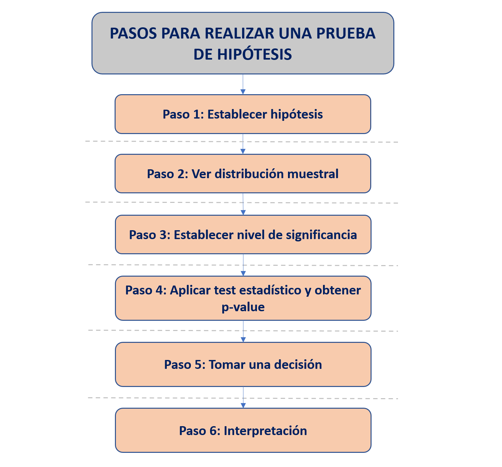
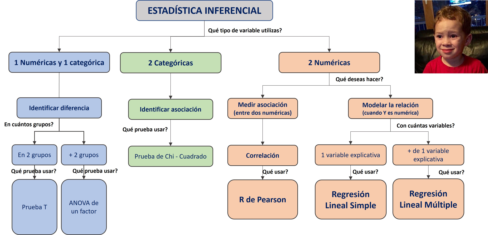
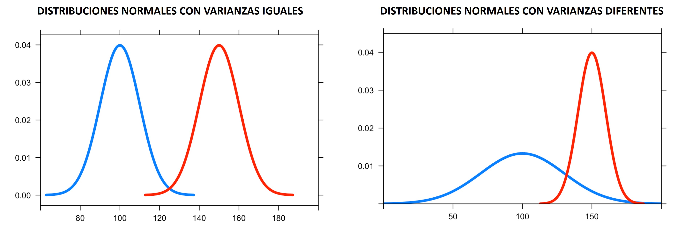
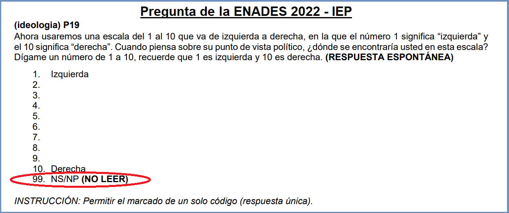
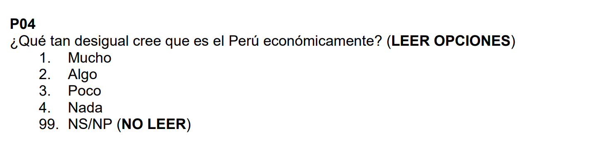

# Comparación en dos muestras (t.test y prop.test)

## Recordemos

### Prueba de hipótesis

Habíamos dicho que una prueba de hipótesis estadística es una herramienta utilizada para evaluar si una **afirmación sobre una población** es **probablemente verdadera o falsa**, basándose en los **datos de una muestra** de esa población.

Puedes pensar en una prueba de hipótesis como un juicio, en el cual el acusado es la hipótesis nula (afirmación a evaluar) y la hipótesis alternativa es la acusación. 


### Flujograma

También habíamos establecido algunos pasos básicos para entender el proceso de utilización de una prueba de hipótesis. 



### Tipos de prueba de hipótesis

Ahora bien, existen múltiples pruebas de hipótesis dependiendo de:

- **Características de la data**: Con fines de este curso, vamos a abordar un conjunto de pruebas de hipótesis que están construidas para tratar con datos que siguen una distribución normal. Este tipo de pruebas de hipótesis se le conoce como **métodos paramétricos**. En otras palabras, vamos a asumir que las variables que estamos eligiendo provienen de una distribución normal. 


- **Objetivo del investigador**: Una prueba de hipótesis nos puede servir para evaluar muchas afirmaciones sobre la población. 

En este curso vamos a abordar algunas de las preguntas de investigación más conocidas: 


a) La media de esta variable numérica es distinta en dos grupos a nivel de la población?

b) La media de esta variable numérica es ditinta en tres a más grupos a nivel de la población?

c) Dos variables categóricas están asociadas en la población?

d) Dos variables numéricas están asociadas en la población?

e) Es posible modelar la relación entre una variable numérica (dependiente) y un conjunto de variables (independientes)?




## Diferencia de medias (t.test)

La prueba T para comparar una media en dos grupos es una técnica estadística que se utiliza para determinar si la diferencia entre las medias de dos grupos es estadísticamente significativa o simplemente el resultado del azar.

La prueba T se basa en la **distribución T de Student**, que es una distribución de probabilidad que se utiliza cuando el tamaño de la muestra es pequeño o la varianza poblacional es desconocida. 


> Será bastante común que en la descripción de una prueba de hipótesis se haga referencia a una distribución teórica que ayudará a establecer las probabilidades. Aquí está el core estadístico que sustenta la inferencia!

### Pregunta de investigación

Para iniciar, debemos tener claro nuestra pregunta que deseamos responder. 

¿El monto mínimo **promedio** necesario para que un hogar pueda subsistir (p08) será diferente entre el área urbana y rural (area2) a nivel poblacional?


### Paso 0: Análisis exploratorio de datos (EDA)

No está en el flujograma, pero siempre debes seguir algunos pasos previos. 

Desde lo más general a lo más específico, nosotros debemos:

Abrir la base de datos. Vamos a seguir usando ENADES. Puedes ver el cuestionario  [aqui](https://iep.org.pe/wp-content/uploads/2022/08/Cuestionario-Oxfam-IEP.-ENADES-2022-final.pdf): 

```{r}
library(pacman)
p_load(haven, tidyverse, lsr, kableExtra)
enades<-read_spss("data/ENADES_2022.sav")
```

**CONFIGURACIÓN ADECUADA DE LAS VARIABLES A UTILIZAR** 

En este caso deseo comparar la variable monto mínimo mensual que requiere su hogar para vivir (p08)...

```{r}
enades$p08<-as.numeric(enades$p08)
str(enades$p08)
```

...En los grupos establecidos por la variable ámbito (urbano/rural)  

```{r}
enades$area2<-factor(enades$area2, # Nombre de la variable a convertir
                     levels=1:2, # Definimos los niveles (esta variable sólo tenía 2 niveles)
                     labels=c("Urbano", "Rural")) #Colocamos sus etiquetas
str(enades$area2)
```


**EXPLORACIÓN DE LOS ESTADÍSTICOS MUESTRALES** 

Si bien nos interesa calcular la media poblacional, primero tenemos que tener en cuenta cuál es la media en nuestra muestra. 

Ahora hacemos un primer sondeo de cuál es la media muestral...

```{r}
enades |> 
  summarise(mean(p08, na.rm=T))
```


...y cuál es la media muestral en cada uno de los grupos seleccionados que deseamos comparar.

```{r}
enades |> 
  group_by(area2) |> 
  summarise(mean(p08, na.rm=T))
```

Esto nos ayuda a corroborar que tenemos toda la información necesitaria lista para llevar a cabo una prueba de hipótesis. 


### Paso 1: Establecer hipótesis

Debemos plantear las hipótesis nula y alternativa. 

Recuerda que cada prueba tiene su hipótesis nula, por lo que hay que memorizar algunas de estas. En el caso de la Prueba T, las hipótesis son las siguientes:

Hipótesis  | Descripción | Notación
------------- | ------------- | -------------
Hipótesis nula  | Las medias poblacionales son iguales | $H_0: \mu_1 = \mu_2$
Hipótesis alterna  | Las medias poblacionales son diferentes | $H_1: \mu_1 \neq \mu_2 $

Estas son las hipótesis que vamos a validar con nuestra prueba. 


### Paso 2: Verificar supuestos

**INDEPENDENCIA**

Las muestras deben ser independientes. El muestreo debe ser aleatorio. Vamos a asumir ello porque normalmente no tenemos control sobre el proceso de muestreo. 


**DISTRITUCIÓN NORMAL**

Para los fines de este curso, asumimos que la variable numérica proviene de una distribución normal en la población. 

**HOMOGENEIDAD DE VARIANZAS**

Identificamos si las varianzas son iguales en los dos grupos analizados. En el caso de que sean diferentes, vamos a necesitar hacer un **ajuste* a la fórmular de cálculo.



Veamos antes una visualización de los datos:

```{r}
enades |> 
  ggplot() + 
  aes(x = p08, fill = area2) + 
  geom_density(alpha = 0.3) +
  scale_fill_manual(values = c("#00BFC4", "#F8766D")) +
  labs(title = "Distribución de variable p08 por grupo", x = "Variable", y = "Densidad")
```
De forma predeterminada, vemos que la varianza, es decir cómo varian los datos en el área urbana es distinta a la rural (la mayoría de datos se concentra en un rango menor)

Otra forma de compararlo, es a través de un boxplot:

```{r}
enades |> 
  ggplot() + 
  aes(x = p08, fill = area2) + 
  geom_boxplot() +
  scale_fill_manual(values = c("#00BFC4", "#F8766D")) +
  labs(title = "Distribución de variable p08 por grupo", x = "Variable", y = "Densidad") + coord_flip()
  
```
Esto lo corroboramos con el gráfico de cajas. El 50% superior en el caso urbano tiene un rango mucho mayor. Asimismo, podemos ver algunos valores extremos que se alejan a valores muy altos, en el caso del sector Urbano. 

Para fines de este ejercicio, vamos a considerar que las **varianzas son diferentes en ambos grupos analizados**.


### Paso 3: Establecer nivel de significancia

Estamos trabajando a un 95% de confianza, por lo que nuestro nivel de significancia será 0.05.

$$\alpha = 0.05$$

### Paso 4: Calcular estadístico de prueba y p-valor 

Ahora utilizemos la función `t.test()` para realizar el cálculo del Estadístico T y el cálculo del p-valor. 

```{r}
t.test(p08 ~ area2, #Colocamos la variable numérica y la variable grupo. Ese símbolo ~ (en Windows) es ALT + 126
       alternative = "two.sided", # Siempre que comparemos un estadístico en dos grupos usaremos "two.sided".
       data = enades, # Precisamos la data
       var.equal=F) # Precisamos si las varianzas son iguales. En este caso colocamos F, porque identificamos diferencia 
```


El **estadístico de prueba** en este caso es el Estadítico T, el cual es 10.992.

Ahora bien, lo que hace la prueba es comparar este valor observable del Estadístico T con un valor teórico, de acuerdo a la distribución T. Dicha comparación lo que arroja es una probabilidad de obtener ese valor observado, en caso la hipótesis nula (medias iguales) es verdadera

En este caso, nuestro p-value es p-value < 2.2e-16. El cual es un número muy pequeño.


> RECUERDA: El número 2.2e-16 es una forma abreviada de escribir un número muy pequeño en notación científica. En este caso, equivale a 0.00000000000000022 o 2.2 multiplicado por 10 elevado a la potencia -16. Es común utilizar esta notación en estadística y otras áreas de la ciencia para representar números muy grandes o muy pequeños de manera más concisa.


### Paso 5: Tomar una decisión


Tenemos los siguientes escenarios

Resultado  | Decisión
------------- | -------------
$p-value <=\alpha$  | Rechazamos la hipótesis nula.
$p-value >\alpha$  | No rechazamos la hipótesis nula.

En nuestro caso nuestro habíamos escogido un $\alpha = 0.05$ por lo que al obtener un p-valor de 2.2e-16 (0.00000000000000022) rechazamos la hipótesis nula de que nuestras medias poblacionales son iguales.

En otras palabras, un p-valor de 0.00000000000000022 significa que hay una probabilidad muy baja de obtener los resultados **observados en la muestra** si la verdadera diferencia entre las medias poblacionales es cero (hipótesis nula). Es decir, si la hipótesis nula fuera verdadera y no hay diferencia real entre las medias poblacionales, la probabilidad de observar una diferencia tan grande o mayor entre las medias muestrales es muy baja, de solo 0.000002.


### Paso 6: Interpretación

Ahora bien, al finalizar este proceso debemos interpretar nuestros resultados. 

En este punto tienes que recordar que estamos trabajando con probabilidades, no existen **certezas absolutas**, por lo tanto, nuestra interpretación final debe considerar ello. Deberíamos concluir:

**Luego de realizar una prueba T, a un 95% de confianza, obtuvimos un p-valor de 2.2e-16, por lo que rechazamos la hipótesis nula de que el monto mínimo mensual que requiere su hogar para vivir es igual en el área urbana y en el área rural. Por ello, concluimos que existen diferencias estadísticamente significativas en ambos grupos poblacionales.**


### Ahora hazlo tú!

Considera la variable p19 (ideología). 

Deseamos saber si existe diferencia en el promedio de esta variable en el sector rural y urbano. 

- Realice una comparación de medias en ambos grupos utilizando la prueba de hipótesis más pertinente. Muestre sus resultados e interprete. 


### A tener en cuenta 

#### Prueba de hipótesis para igualdad de varianzas

Como te sugerí líneas arriba, siempre es bueno realizar una exploración visual con un boxplot para encontrar indicios sobre la existencia de homogeneidad de varianzas en dos o más grupos. 

Sin perjuicio de ello, para poder verificar este supuesto de homogenedidad de varianzas de forma más rigurosa podemos aplicar una **Prueba de Levene de Homogeneidad de Varianzas**.

```{r message=FALSE, warning=FALSE}
library(DescTools)
LeveneTest(enades$p08, enades$area2)
```
Recordamos nuestras hipótesis a validar:

Hipótesis  | Descripción | Notación
------------- | ------------- | -------------
Hipótesis nula  | Las varianzas poblacionales son homogéneas | $H_0: v_1 = v_2$
Hipótesis alterna  | Las varianzas poblacionales son diferentes | $H_1: v_1 \neq v_2 $


Luego de realizar una prueba de Levene, a un 95% de confianza, obtuvimos un p-valor de 0.0001660599, por lo que rechazamos la hipótesis nula de que la varianza del monto mínimo mensual que requiere su hogar para vivir es igual/homogénea en el área urbana y en el área rural. Por ello, concluimos que existen diferencias estadísticamente significativas en las varianzas de ambos grupos poblacionales.


#### Valores faltantes en las encuestas



En las encuestas, los valores perdidos son aquellos que faltan en las respuestas proporcionadas por los encuestados. Esto puede suceder porque el encuestado decidió no responder a la pregunta, porque no entendió la pregunta o porque la pregunta simplemente no se aplicaba a él o ella.

Para manejar los valores perdidos, a menudo se utiliza la técnica de imputación, que implica reemplazar los valores faltantes por algún valor estimado. En algunos casos, se puede asignar un valor específico, como 99 o 999, para indicar que el encuestado no sabe o no responde a la pregunta. Este enfoque se utiliza comúnmente en encuestas de opinión pública y otras encuestas que involucran preguntas sensibles.

Sin embargo, es importante tener en cuenta que asignar un valor específico a los valores perdidos puede afectar los resultados de la encuesta y la validez de los análisis estadísticos posteriores. Por lo tanto, es importante evaluar cuidadosamente las estrategias de manejo de valores perdidos y elegir la opción más adecuada para el conjunto de datos y el análisis específicos.


## Diferencia de proporciones (prop.test)

Así como existe una prueba de hipótesis para comparar medias, también existe una para comparar proporciones. 

La prueba de diferencia de proporciones (prop.test) en R es una prueba estadística que se utiliza para comparar dos proporciones en una muestra o en dos muestras independientes. Para ello, se utiliza la distribución teórica **chi cuadrado**.

La hipótesis nula es que no hay diferencia entre las proporciones, mientras que la hipótesis alternativa es que hay una diferencia significativa entre las proporciones.

Un ejemplo de su aplicación en ciencias sociales podría ser en una encuesta en la que se desea comparar la proporción de hombres y mujeres que apoyan una determinada candidatura política. Se tomarían dos muestras independientes, una de hombres y otra de mujeres, y se compararían las proporciones de apoyo a la candidatura en cada grupo mediante la prueba de diferencia de proporciones. Si se encontrara una diferencia significativa, se podría concluir que hay una diferencia en las proporciones de apoyo entre hombres y mujeres.

Veámoslo con un ejemplo.

### Pregunta de investigación

Al igual que en prueba T, debemos tener claro nuestra pregunta que deseamos responder: 


¿La proporción de personas que opinan que existe **Mucha** desigualdad económica en el país será diferente entre el área urbana y rural (area2) a nivel poblacional?


### Paso 0: Análisis exploratorio de datos (EDA)

Vamos a seguir usando ENADES.

**CONFIGURACIÓN ADECUADA DE LAS VARIABLES A UTILIZAR** 



Vamos a hacer una primera exploración de la variable:

```{r}
summary(enades$p04)
```
Vemos que sì tenemos valores perdidos. En este caso 37. 

```{r}
table(enades$p04) # Cuando solicitas la tabla no te muestra los NA!
```
No obstante, no tenemos problemas de casos que hayan contestado NS/NR (codificados con 99). Procedemos a convertirlo en factor:

```{r}
enades$p04<-factor(enades$p04, # Nombre de la variable a convertir
                     levels=1:4, # Definimos los niveles (esta variable sólo tenía 2 niveles)
                     labels=c("Mucho", "Algo", "Poco", "Nada")) #Colocamos sus etiquetas
str(enades$p04)
```

En los grupos seguimos teniendo la variable ámbito (urbano/rural).   

```{r}
# enades$area2<-factor(enades$area2, # Nombre de la variable a convertir
#                      levels=1:2, # Definimos los niveles (esta variable sólo tenía 2 niveles)
#                      labels=c("Urbano", "Rural")) #Colocamos sus etiquetas
str(enades$area2)
```

**EXPLORACIÓN DE LOS ESTADÍSTICOS MUESTRALES** 

Primero, veamos la proporción de encuestados que contestó cada categoría de la pregunta p04. Para eso, creamos una tabla simple:

```{r}
tabla_simple<-table(enades$p04,enades$area2) #Se sugiere colocar el grupo como segunda variable.
tabla_simple #Mostramos la tabla creada
```

Luego, sobre la tabla creada, solicitamos algunos cambios. 

```{r}
tabla_simple |>    # Esta es la tabla simple que creaste arriba
  prop.table(2) |> # Que nos muestre la tabla en proporciones. El "2" es para pedir que sea por columnas. 
  round(4) |>      # Que redondee los valores a 4 dígitos
  addmargins(1) |> # Que la FILA de totales. Si deseamos la columna de totales entonces sería 2.
  kbl() |>         # Estos dos últimos son sólo para que se muestre en HTML (mejor formato).
  kable_styling()
```

Damos cuenta que en el sector urbano el 60.47% sostuvo que existe Mucha desigualdad económica, mientras que en el sector rural sólo el 46.34%.

> EFECTIVAMENTE OBSERVAMOS UNA DIFERENCIA DE PROPORCIONES A NIVEL MUESTRAL. Ahora probemos nuestra hipótesis a nivel poblacional


### Paso 1: Establecer hipótesis

Debemos plantear las hipótesis nula y alternativa. 

En el caso del Prop.Test, las hipótesis son las siguientes:

Hipótesis  | Descripción | Notación
------------- | ------------- | -------------
Hipótesis nula  | Las proporciones poblacionales son iguales | $H_0: p_1 = p_2$
Hipótesis alterna  | Las proporciones poblacionales son diferentes | $H_1: p_1 \neq p_2$

Estas son las hipótesis que vamos a validar con nuestra prueba. 


### Paso 2: Verificar supuestos

**INDEPENDENCIA**

Las muestras deben ser independientes. El muestreo debe ser aleatorio. Vamos a asumir ello porque normalmente no tenemos control sobre el proceso de muestreo. 


**En este caso no corroboramos varianza homogénea debido a que nuestra variable de interés es categórica.**


### Paso 3: Establecer nivel de significancia

Estamos trabajando a un 95% de confianza, por lo que nuestro nivel de significancia será 0.05.

$$\alpha = 0.05$$


### Paso 4: Calcular estadístico de prueba y p-valor 

Ahora utilizemos la función `prop.test()` para realizar el cálculo del Estadístico Chi-Cuadrado y el cálculo del p-valor.

Para ello, necesitamos dos datos.

- ¿Cuántos **CASOS** han contestado **Mucho** en la pregunta p04 en cada grupo (urbano y rural)?

```{r}
tabla_simple
```

Ok, en el ámbito Urbano hay 754 y en el ámbito 114. 

- ¿Cuántos **CASOS** hay en cada grupo (urbano y rural)?

```{r}
table(enades$area2)
```

Ok, tenemos 1273 para el área urbana y 257 para el área rural. 

Ahora sí, calculemos el `prop.test`:

```{r}
prop.test(x=c(754,144), #Número de personas que contestaron Mucho en el ámbito Urbano y Rural
          n=c(1273, 257)) #Número de personas que hay en el el ámbito Urbano y Rural en mi muestra.

#TEN CUIDADO CON EL ORDEN!
```


### Paso 5: Tomar una decisión

Tenemos los siguientes escenarios

Resultado  | Decisión
------------- | -------------
$p-value <=\alpha$  | Rechazamos la hipótesis nula.
$p-value >\alpha$  | No rechazamos la hipótesis nula.

En nuestro caso nuestro habíamos escogido un $\alpha = 0.05$ por lo que al obtener un p-valor de 0.3785 no podemos rechazar la hipótesis nula de que nuestras proporciones poblacionales son iguales.

### Paso 6: Interpretación

Concluimos que:

**Luego de realizar una prueba de diferencia de proporciones, a un 95% de confianza, obtuvimos un p-valor de 0.3785, por lo que no podemos rechazar la hipótesis nula de que las proporciones de población que opinan que existe Mucha desigualdad económica son iguales en el área urbana y en el área rural. Por ello, concluimos que no existen diferencias estadísticamente significativas en ambos grupos.**


### Ahora hazlo tú!

Considera las siguientes variables:

- **ideologia3**: Las categorías de esta variable son 1:Izquierda, 2:Centro y 3:Derecha.

- **zona3**: Las categoría de esta variable son 1:Lima Metropolitana y 2: Perú sin Lima

Deseamos responder a la pregunta: 

**¿Existe una diferencia en la proporción de personas que se identifican con una ideología de derecha según su lugar de procedencia (Lima Metropolitana o resto del país)?**

Realice la prueba de hipótesis más pertinente. Muestre sus resultados e interprete. 


