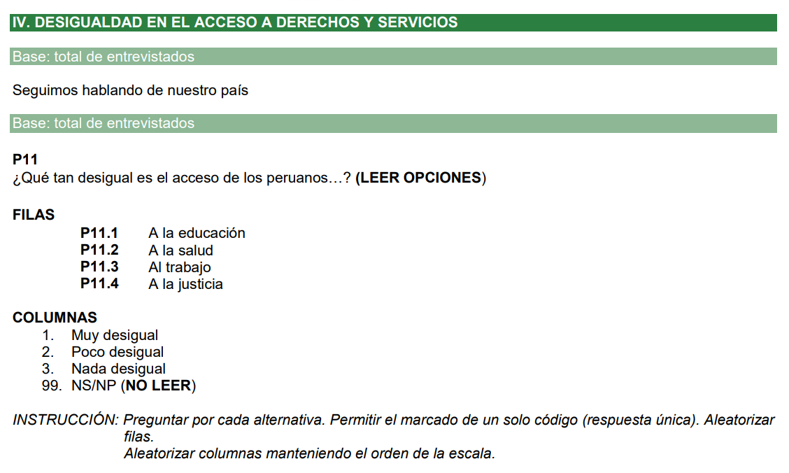

# ANOVA: Comparación en más de dos muestras

## Recordemos

### Flujograma

Anteriormente habíamos establecido algunos pasos básicos para entender el proceso de utilización de una prueba de hipótesis. 


### Qué sigue?


## ANOVA de un factor


El análisis de varianza (ANOVA) de un factor en R es una técnica estadística utilizada para comparar la media de una variable numérica entre más de dos grupos. Se realiza un ANOVA de un factor cuando se tiene un solo factor categórico (con tres o más niveles) que se utiliza para agrupar los datos, y se quiere determinar si existe una diferencia estadísticamente significativa entre las medias de los grupos.

El ANOVA es una herramienta útil para analizar datos experimentales en los que se desea comparar las medias de más de dos grupos. En lugar de **realizar múltiples pruebas t de dos muestras**, el ANOVA nos permite realizar una sola prueba para determinar si hay una diferencia significativa entre los grupos.

Los pasos para aplicación del ANOVA son los mismos que los seguidos para el T de Student, visto la clase anterior. 


### Pregunta de investigación


### Paso 0: Análisis exploratorio de datos (EDA)

**ABRIR LA DATA**

```{r}
library(pacman)
p_load(haven, tidyverse, lsr, kableExtra)
enades<-read_spss("https://github.com/ChristianChiroqueR/banco_de_datos/raw/main/ENADES_2022.sav")
```


**CONFIGURACIÓN ADECUADA DE LAS VARIABLES A UTILIZAR** 

#### Nuestra numérica: Índice aditivo

En este caso deseamos realizar un índice aditivo de **Percepción sobre la desigualdad en el acceso a servicios públicos**.

Para ello, vamos a utilizar estas cuatro variables:



Volvemos a recodificar 

```{r}
enades<-enades |> 
  mutate(p11.1n=case_when(p11.1==1~ 3,
                          p11.1==2~2,
                          p11.1==3~1,
                          TRUE~NA_real_),
         p11.2n=case_when(p11.2==1~ 3,
                          p11.2==2~2,
                          p11.2==3~1,
                          TRUE~NA_real_),
         p11.3n=case_when(p11.3==1~ 3,
                          p11.3==2~2,
                          p11.3==3~1,
                          TRUE~NA_real_),
         p11.4n=case_when(p11.4==1~ 3,
                          p11.4==2~2,
                          p11.4==3~1,
                          TRUE~NA_real_))
```

Ahora sí podremos realizar el índice aditivo.

```{r}
enades<-enades |> 
  mutate(indice_aditivo=p11.1n+p11.2n+p11.3n+p11.4n)
```


```{r}
enades |> 
  count(indice_aditivo)
```

```{r}
library(scales)
enades$indice_aditivo<-rescale(enades$indice_aditivo, to=c(0,10)) #Aquí mencionas que quieresque la nueva escala sea de 0 al 10. 
```


#### Nuestros grupos

```{r}
enades$ambito<-factor(enades$ambito, # Nombre de la variable a convertir
                     levels=1:3, # Definimos los niveles (esta variable sólo tenía 2 niveles)
                     labels=c("Lima Metropolitana", "Perú urbano", "Perú rural")) #Colocamos sus etiquetas
table(enades$ambito)
```


**EXPLORACIÓN DE DATOS MUESTRALES** 

```{r}
enades |> 
  group_by(ambito) |> 
  summarise(Media=mean(indice_aditivo, na.rm = T))
```


### Paso 1: Establecer hipótesis

Debemos plantear las hipótesis nula y alternativa. 

Recuerda que cada prueba tiene su hipótesis nula, por lo que hay que memorizar algunas de estas. En el caso de la Prueba T, las hipótesis son las siguientes:

Hipótesis  | Descripción 
------------- | ------------- 
Hipótesis nula  | Las medias poblacionales **en todos los grupos** son iguales 
Hipótesis alterna  | **Al menos una de las medias** de las grupos es diferente de las demás. 
 
Estas son las hipótesis que vamos a validar con nuestra prueba. 


### Paso 2: Verificar supuestos

**INDEPENDENCIA**

Las muestras deben ser independientes. El muestreo debe ser aleatorio. Vamos a asumir ello porque normalmente no tenemos control sobre el proceso de muestreo. 


**DISTRITUCIÓN NORMAL**

Para los fines de este curso, asumimos que la variable numérica proviene de una distribución normal en la población. 

**HOMOGENEIDAD DE VARIANZAS**

Para los fines de este curso, asumimos que la variable numérica posee homogeneidad de varianzas en cada grupo analizado.


### Paso 3: Establecer nivel de significancia

Estamos trabajando a un 95% de confianza, por lo que nuestro nivel de significancia será 0.05.

$$\alpha = 0.05$$

### Paso 4: Calcular estadístico de prueba y p-valor 

Para calcular el ANOVA de un factor utilizamos la función `aov()`:

```{r}
anova1 = aov(enades$indice_aditivo~enades$ambito)
summary(anova1)
```

En este caso, al igual que con las otras pruebas de hipótesis, se calcula un estadístico y se compara con una distribución teórica. 


### Paso 5: Tomar una decisión

Tenemos los siguientes escenarios

Resultado  | Decisión
------------- | -------------
$p-value <=\alpha$  | Rechazamos la hipótesis nula.
$p-value >\alpha$  | No rechazamos la hipótesis nula.


Habíamos escogido un $\alpha = 0.05$ por lo que al obtener un p-valor de 0.0132 rechazamos la hipótesis nula de que nuestras medias poblacionales son iguales en todos los grupos.

En otras palabras, un p-valor de 0.0132 significa que hay una probabilidad muy baja de obtener los resultados **observados en la muestra** si la verdadera diferencia entre las medias poblacionales entre grupos es cero (hipótesis nula). 

Esta probabilidad se encuentra por debajo de nuestro último nivel de rareza que estamos dispuestos a aceptar (0.05) por lo que rechazamos la H0.


### Paso 6: Interpretación

Ahora bien, al finalizar este proceso debemos interpretar nuestros resultados: 

**Luego de realizar una prueba ANOVA, a un 95% de confianza, obtuvimos un p-valor de 0.0132, por lo que rechazamos la hipótesis nula de que la media del Índice de percepción de Desigualdad es igual en todos los ámbitos analizados (Lima Metropolitana, Perú urbano, Perú rural). Por ello, concluimos que existen diferencias estadísticamente significativas en alguno de los grupos poblacionales indicados.**


## Identificar el/los grupos diferentes

### Pruebas post hoc: Test de Tukey

Las pruebas de comparaciones múltiples son pruebas estadísticas que se utilizan para comparar múltiples grupos y determinar si hay diferencias significativas entre las medias de los grupos. En lugar de realizar varias pruebas t o ANOVA independientes para comparar cada par de grupos, las pruebas de comparaciones múltiples realizan todas las comparaciones de manera simultánea.

La prueba Tukey, también conocida como prueba de rango múltiple de Tukey, es una prueba de comparaciones múltiples que se utiliza para determinar cuáles de los pares de grupos tienen medias significativamente diferentes. Esta prueba se basa en el rango de las medias de los grupos y en la estimación del error estándar de la media. La prueba de Tukey compara la diferencia entre las medias de cada par de grupos con una cantidad crítica que se basa en la variabilidad de los datos. Si la diferencia entre las medias de dos grupos es mayor que esta cantidad crítica, se considera que las medias son significativamente diferentes.

Una vez que hemos creado nuestro objeto ANOVA (en nuestro caso llamado **anova1**), podemos solicitar la prueba Tukey sobre dicho objeto.

```{r}
comparacion = TukeyHSD(anova1)
comparacion
```

Para leer este resultado debemos preguntarnos dos cosas:

- ¿En qué parejas existe una diferencia significativa?

Vemos el p-value. 

Estas se deben leer como Pruebas T calculada para cada pareja de grupos. ¿Cuáles eran las hipótesis que testeamos?

- Corrobora el resultado viendo el intervalo de la diferencia. 

Si el 0 está incluido en este intervalo, entonces dicha diferencia puede ser 0. Siempre hay una correspondencia: si el p valor no es significativo, el intervalo de la diferencia incluye al 0. 

### Visualización

Exploramos el objeto que creamos arriba.

```{r}
diferencias_parejas = as.data.frame(comparacion[1])
diferencias_parejas
```


Hemos generado un dataframe con los valores de las diferencias estimadas en cada pareja y los límites inferiores y superiores de cada diferencia estimada. 

Ahora creamos una columna adicional en dicho data frame que tenga el detalle de la pareja. 

```{r}
diferencias_parejas$parejas = rownames(diferencias_parejas)
```

Ahora solicitamos un gráfico de barras de error utilizando la librería `ggplot2`.

```{r}
diferencias_parejas |> 
  ggplot()+
  aes(x=parejas, y=enades.ambito.diff)+
  geom_errorbar(aes(ymin=enades.ambito.lwr, ymax=enades.ambito.upr), width=0.2)+
  geom_text(aes(label=paste(round(enades.ambito.diff, 1))), vjust=-1, size=3)+
  xlab("Comparaciones") + ylab("Diferencia encontrada")+
  ylim(-1, 1) +
  coord_flip() +
  geom_hline(yintercept = 0, color = "red", linetype="dotted") +
  theme_classic()
```

Con este gráfico debemos corroborar los resultados que arroja la prueba de comparaciones múltiples de Tukey. 


## Ejercicio 1

Deseamos responder a la pregunta: 

**¿Existe una diferencia en el apoyo a un modelo intervencionista del Estado según la postura ideológica?**

Realice la prueba de hipótesis más pertinente. Muestre sus resultados e interprete. 


Considera las siguientes variables:

-  **ABROS4**: En una escala de 1 a 10, ¿qué tan de acuerdo o en desacuerdo se encuentra con las siguientes afirmaciones respecto al Perú? - El Estado peruano debe implementar políticas firmes para reducir la desigualdad de ingresos entre ricos y pobres.


-  **ideologia2**: Variable que distingue si la persona se identifica con una postura de izquierda, centro o derecha. 


## Ejercicio 2

Se cuenta con la hipótesis que el promedio de monto mínimo mensual que se requiere para vivir, en promedio, es menor si la persona tiene una ideología de izquierda y mayor si tiene una ideología de derecha. 

Realice la prueba de hipótesis más pertinente. Muestre sus resultados e interprete. 

Considera las siguientes variables:

- **P08**: Monto mínimo mensual que requiere su hogar para vivir.

- **ideologia2**: Las categorías de esta variable son 1:Izquierda, 2:Centro y 3:Derecha.


