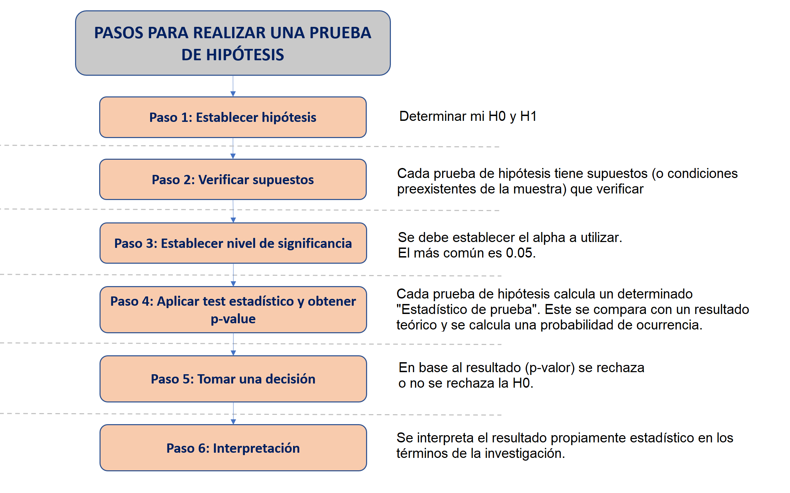

# ANOVA: Comparación en más de dos muestras

## Recordemos

### Flujograma

Anteriormente habíamos establecido algunos pasos básicos para entender el proceso de utilización de una prueba de hipótesis. 



### Qué sigue?


## ANOVA de un factor


El análisis de varianza (ANOVA) de un factor en R es una técnica estadística utilizada para comparar la media de una variable numérica entre más de dos grupos. Se realiza un ANOVA de un factor cuando se tiene un solo factor categórico (con tres o más niveles) que se utiliza para agrupar los datos, y se quiere determinar si existe una diferencia estadísticamente significativa entre las medias de los grupos.

El ANOVA es una herramienta útil para analizar datos experimentales en los que se desea comparar las medias de más de dos grupos. En lugar de **realizar múltiples pruebas t de dos muestras**, el ANOVA nos permite realizar una sola prueba para determinar si hay una diferencia significativa entre los grupos.

Los pasos para aplicación del ANOVA son los mismos que los seguidos para el T de Student, visto la clase anterior. 


### Pregunta de investigación


### Paso 0: Análisis exploratorio de datos (EDA)

**ABRIR LA DATA**


**CONFIGURACIÓN ADECUADA DE LAS VARIABLES A UTILIZAR** 


**EXPLORACIÓN DE DATOS MUESTRALES** 


### Paso 1: Establecer hipótesis

Debemos plantear las hipótesis nula y alternativa. 

Recuerda que cada prueba tiene su hipótesis nula, por lo que hay que memorizar algunas de estas. En el caso de la Prueba T, las hipótesis son las siguientes:

Hipótesis  | Descripción 
------------- | ------------- 
Hipótesis nula  | Las medias poblacionales **en todos los grupos** son iguales 
Hipótesis alterna  | **Al menos una de las medias** de las grupos es diferente de las demás. 
 
Estas son las hipótesis que vamos a validar con nuestra prueba. 


### Paso 2: Verificar supuestos

**INDEPENDENCIA**

Las muestras deben ser independientes. El muestreo debe ser aleatorio. Vamos a asumir ello porque normalmente no tenemos control sobre el proceso de muestreo. 


**DISTRITUCIÓN NORMAL**

Para los fines de este curso, asumimos que la variable numérica proviene de una distribución normal en la población. 

**HOMOGENEIDAD DE VARIANZAS**

Identificamos si las varianzas son iguales en los grupos analizados. En el caso de que sean diferentes, vamos a necesitar hacer un **ajuste* a la fórmular de cálculo.

Vamos a hacer una exploración visual utilizando boxplot para verificar indicios de homogeneidad de varianzas. 

```{r}

```

Luego, para validar, realizamos el test de Levene, el cual ya hemos aprendido que es una prueba de hipótesis en la que la H0 es: "Existe homogenidad de varianzas".

### Paso 3: Establecer nivel de significancia

Estamos trabajando a un 95% de confianza, por lo que nuestro nivel de significancia será 0.05.

$$\alpha = 0.05$$

### Paso 4: Calcular estadístico de prueba y p-valor 


### Paso 5: Tomar una decisión

Tenemos los siguientes escenarios

Resultado  | Decisión
------------- | -------------
$p-value <=\alpha$  | Rechazamos la hipótesis nula.
$p-value >\alpha$  | No rechazamos la hipótesis nula.


### Paso 6: Interpretación

.


### Extra: Visualización

.


### Ahora hazlo tú!

.


