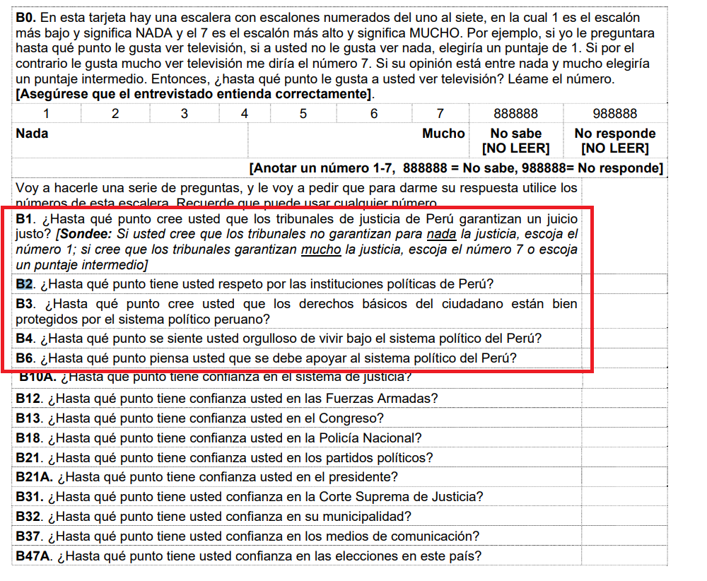

# EJERCICIO DE REPASO

## Base de datos: LAPOP

El Proyecto de Opinión Pública de América Latina (LAPOP) es un proyecto de investigación multinacional especializando en el desarrollo, implementación y análisis de encuestas de opinión pública.


La encuesta mide los valores y comportamientos democráticos en el continente americano usando muestras probabilísticas nacionales de la población adulta en edad de votar.

```{r echo=TRUE, message=FALSE, warning=FALSE}
library(haven)
library(tidyverse)
lapop<-read_dta("https://github.com/ChristianChiroqueR/banco_de_datos/raw/main/DATA_Peru/PERU_LAPOP__2021.dta")
sublapop<-lapop %>% 
  filter(core_a_core_b=="Core A")
```

## Problema


A Ud. lo han contratado para examinar la postura que tiene la población frente a las instituciones políticas en el país. Debido a la complejidad del problema, se hará un análisis inferencial de distintos niveles y para el cual se debe responder con la técnica estadística más adecuada. 


## Ejercicio 1: Índice de respaldo al sistema político

a) Construya un índice sobre **Respaldo al sistema político** con las siguientes preguntas. Asegúrese que la escala del índice final sea de 0-1.




b) Configure adecuadamente la variable UR1NEW a fin de que existan dos grupos (cree una copia que se llame "ambito"):


- 1: Zona urbana (Una ciudad/En la periferia o alrededores de una ciudad/asentamientos humanos)


- 2: Zona rural (En un pueblo/poblado cercano a una zona/un área rural / En un área/una zona rural)


## Ejercicio 2: Exploración

Muestre la media del índice creado a nivel de la muestra. Asimismo, calcule la media por grupo según ámbito. 

Presente un gráfico que permita comparar la distribución de la variable en ambos grupos. Interprete. 


## Ejercicio 3: IC de una media

Cálcule el IC al 95% de confianza del Índice a nivel poblacional. Asimismo, presente un gráfico donde compare los intervalos de confianza según cada grupo según ámbito. 


## Ejercicio 4: Comparación en dos grupos

Compare de forma más rigurosa la media del índice en ambos grupos poblacionales según ámbito. Verifique el supuesto de homogeneidad de varianzas.  

Tenga en cuenta los pasos de la prueba de hipótesis. 


## Ejercicio 5: Comparación en más de dos grupos

Compare la media del índice en los cuatro grupos originales de la variable UR1NEW. Asuma homogeneidad de varianzas.  

Responda: existen diferencia entre los grupos? en qué parejas se ha evidenciado diferencia estadísticamente significativa?
