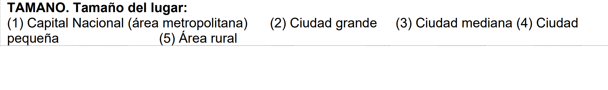
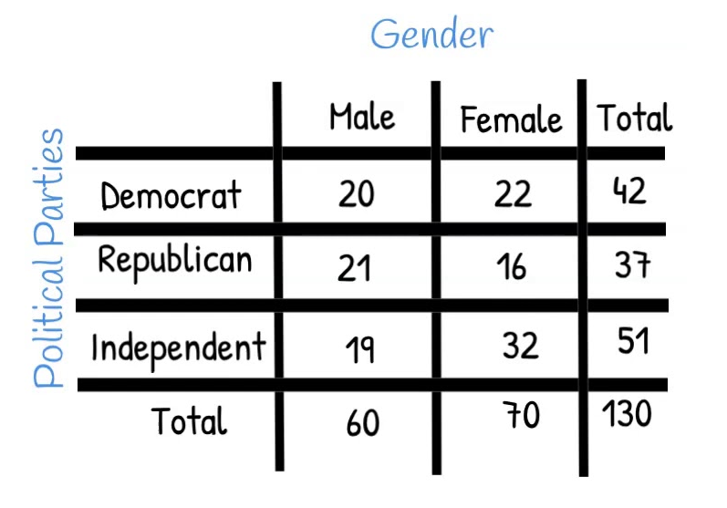
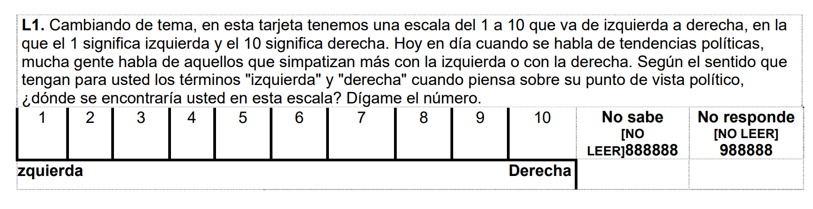

# Asociación de dos factores

## Base de datos: LAPOP

El Proyecto de Opinión Pública de América Latina (LAPOP) es un proyecto de investigación multinacional especializando en el desarrollo, implementación y análisis de encuestas de opinión pública.


La encuesta mide los valores y comportamientos democráticos en el continente americano usando muestras probabilísticas nacionales de la población adulta en edad de votar.

Puede visualizar el cuestionario de la encuesta 2018 [aqui](http://datasets.americasbarometer.org/database/files/ABPer18-v12.0.7.1-Spa-190214_W.pdf)

Puedes descargar la data [aqui](http://datasets.americasbarometer.org/database/files/Peru%20LAPOP%20AmericasBarometer%202019%20v1.0_W.dta)

```{r echo=TRUE, message=FALSE, warning=FALSE}
library(haven)
library(kableExtra)
library(tidyverse)
lapop<-read_dta("https://github.com/ChristianChiroqueR/banco_de_datos/raw/main/DATA_Peru/PERU_LAPOP__2018.dta")
```

## Pregunta de investigaciòn


El presente estudio tiene como objetivo investigar la posible asociación entre el ámbito de residencia (urbano, rural) y la asistencia a manifestaciones. Las manifestaciones públicas son eventos que reflejan la participación activa de la población en la expresión de demandas, opiniones o protestas sobre temas sociales, políticos o económicos.

La diferenciación (brechas) entre los contextos urbanos y rurales puede influir en la participación y la motivación de las personas para asistir a manifestaciones. Se plantea la hipótesis de que existe una asociación entre el ámbito de residencia y la asistencia a manifestaciones.


## Identificando las dos variables categóricas

a) Identifique la variable prot3 "En los últimos 12 meses ha participado en una manifestación o protesta pública" y configure adecuadamente.


```{r}
table(lapop$prot3)
```

```{r}
lapop$prot3<-factor(lapop$prot3, # Nombre de la variable a convertir
                     levels=1:2, # Definimos los niveles (esta variable sólo tenía 2 niveles)
                     labels=c("Sí participó", "No participó")) #Colocamos sus etiquetas
table(lapop$prot3)
```

b) Configure adecuadamente la variable TAMANO a fin de que existan dos grupos (cree una copia que se llame "AMBITO"):



- 1: Zona urbana (Capital Nacional/Ciudad Grande/Ciudad mediana/ Ciudad pequeña)


- 2: Zona rural (Área rural)

```{r}
lapop<-lapop |> 
  mutate(ambito=case_when(tamano<5~ 1,
                          tamano==5~2,
                          TRUE~NA_real_))
```

Convertimos a factor y asignamos niveles:

```{r}
table(lapop$ambito)
```

```{r}
lapop$ambito<-factor(lapop$ambito, # Nombre de la variable a convertir
                     levels=1:2, # Definimos los niveles (esta variable sólo tenía 2 niveles)
                     labels=c("Urbano", "Rural")) #Colocamos sus etiquetas
table(lapop$ambito)
```


## Tablas de contingencia




Una tabla de contingencia, también conocida como **tabla de frecuencia cruzada**, es una forma de organizar y resumir datos en el contexto de un estudio o investigación. Se utiliza para analizar la relación entre dos o más variables categóricas y mostrar **cómo se distribuyen las observaciones en cada combinación de categorías**.

En una tabla de contingencia, las variables de interés se representan en filas y columnas, y se registran las frecuencias o recuentos de las observaciones que caen en cada combinación de categorías. Esto permite visualizar de manera clara y estructurada cómo se relacionan las variables y si existe alguna asociación o dependencia entre ellas.

Las tablas de contingencia son especialmente útiles cuando se quiere examinar la relación entre variables categóricas, como género y preferencia política, ubicación geográfica y nivel educativo, o, como en este caso, el ámbito y si asiste a manifestaciones o no. 

Ahora bien, estas tablas pueden contener recuentos absolutos o frecuencias relativas, y a menudo se incluyen totales marginales que muestran las frecuencias totales de cada variable.

Vamos por partes utilizando el ejemplo que hemos presentado en este ejercicio. 


### TC de frecuencias

Esta tabla se compone de filas y columnas que representan las categorías de las dos variables en estudio. En cada celda de la tabla se registra la frecuencia o recuento de observaciones que pertenecen a una combinación específica de categorías.

```{r}
tabla_simple<-table(lapop$prot3, lapop$ambito)
tabla_simple
```

> Palabra clave: FRECUENCIA!

A esta tabla simple se le puede agregar los totales marginales agregando `addmargins`. 

Podemos agregar ambos, tanto los marginales de columnas como filas.

```{r}
tabla_simple |> 
addmargins()
```

O uno de estos:

```{r}
tabla_simple |> 
addmargins(1) 
```

> RECUERDA: 1 para filas y 2 para columnas!!


### TC de proporciones

En una tabla de contingencia de proporciones, en lugar de mostrar los recuentos absolutos de observaciones en cada casilla, se presentan las proporciones o porcentajes de cada categoría en relación al total de observaciones.

Esta tabla de contingencia de proporciones proporciona una visión relativa de la distribución de las categorías y permite comparar las proporciones entre diferentes grupos o categorías.

El uso de la tabla de contingencia de proporciones puede ser útil para identificar patrones o tendencias en los datos y facilita la interpretación de los resultados en términos de porcentajes relativos.

Ahora bien, debemos tener cuidado cuando solicitemos los porcentajes porque debemos indicar si los porcentajes se calculan por columna o filas. 

Al utilizar la función`prop.table()` en R, el argumento margin se utiliza para especificar si se deben calcular las proporciones por filas o por columnas en una tabla de contingencia.

La elección de este argumento es importante en el marco de un análisis de asociación de variables categóricas, ya que determina cómo se calcularán las proporciones y cómo se interpretarán los resultados.

Si se selecciona margin = 1, se calcularán las proporciones por filas, lo que significa que las proporciones se calcularán dentro de cada fila de la tabla. En este caso, las proporciones se interpretan como la frecuencia de una categoría en relación con el total de observaciones en esa fila.

```{r}
tabla_simple |> 
  prop.table(1)
```

Por otro lado, si se selecciona margin = 2, se calcularán las proporciones por columnas, lo que implica que las proporciones se calcularán dentro de cada columna de la tabla. En este caso, las proporciones se interpretan como la frecuencia de una categoría en relación con el total de observaciones en esa columna.


```{r}
tabla_simple |> 
  prop.table(2)
```

La elección adecuada del argumento margin depende del objetivo del análisis y las preguntas de investigación que se deseen responder. Es importante tener claridad sobre qué aspecto de la asociación entre las variables categóricas se quiere resaltar y qué interpretación es más relevante en el contexto del análisis.


### Variable independiente y dependiente?

En una tabla de contingencia, ambas variables se consideran igualmente importantes y no se establece una relación de dependencia o causalidad entre ellas.

Sin embargo, el investigador normalmente desea investigar la distribución de una variable categórica particular (FILAS) en una variable de grupo (COLUMNAS). En nuestro caso, la primera sería "prot3" y la de grupo "ámbito".

Por ello, se recomienda utilizar la siguiente tabla:

```{r}
tabla_simple |> 
  prop.table(2) |> 
  addmargins(1)
```
CONSIDERACIONES PARA LA LECTURA:

1. Leer fila por fila y de derecha a izquierda, y se interpretan los porcentajes. 

2. Comenzamos por la primera fila de respuestas y analizamos si varían los porcentajes entre las categorías de la variable de grupo (la que está en columnas). En este caso vemos el porcentaje de personas que sí participó en manifestaciones es de 16.9% en el ámbito rural y de 13.47% en el ámbito urbano.

2. Más diferencia de porcentajes en cada fila (entre las categorías de la variable en columnas), más fuerte es la relación entre las variables.

3. Si no hay diferencias de respuestas, es decir, si los porcentajes en una misma fila son muy similares es que no hay relación entre las variables

4. En este caso vemos una ligera asociación. Ahora la siguiente pregunta que debemos hacernos es si esa diferencia es **estadísticamente significativa**. 


Además de proporcionar un resumen descriptivo de los datos, las tablas de contingencia también son la base para realizar pruebas estadísticas como la prueba de chi cuadrado.

En resumen, una tabla de contingencia es una herramienta que permite organizar y resumir los datos de variables categóricas, facilitando el análisis de la relación entre ellas y la realización de pruebas estadísticas para evaluar la asociación o dependencia.


## Gráficando: Barras y barras apiladas

Ahora bien, siempre es mejor contar con un gráfico. Para ello, convertimos nuestra tabla (de proporciones por columna) en un data frame (es la manera más simple).

```{r}
tabla_simple_p<-tabla_simple |> 
                  prop.table(2) |> 
                  round(2)
df <- as.data.frame(tabla_simple_p)
```

Calculamos el gráfico de barras simple. 

```{r}
df |> 
  ggplot()+
  aes(x=Var2, y=Freq, fill=Var1)+
  geom_bar(position = "dodge", stat="identity") +
  geom_text(aes(label=Freq), 
            position = position_dodge(width = 0.9), vjust=0, size = 3)+
  labs(x="Ámbito", y="Proporción", fill="Asistió a una protesta")
```

Sin embargo, es mejor visualizar a través de barras apiladas. 


```{r}
barras_apiladas<-df |> 
  ggplot()+
  aes(x=Var2, y=Freq, fill=Var1) +
  geom_bar(position="stack", stat="identity")+
  geom_text(aes(label=Freq), 
            position = position_stack(), vjust=1, size = 3)+
  labs(x="Ámbito", y="Porcentaje", fill="Asistió a una protesta")
barras_apiladas
```

Las ventajas son las siguientes:

- Las barras apiladas son un tipo de gráfico en el cual se representan las proporciones de distintas categorías en forma de barras que se apilan una encima de la otra. En lugar de mostrar los valores absolutos, se muestran los valores relativos en forma de porcentajes.

- La importancia de utilizar barras apiladas de porcentaje en la comparación y determinación de asociación de dos variables categóricas radica en que permite visualizar de manera clara las proporciones o frecuencias relativas de cada categoría en relación con la variable "independiente" (grupo) y si existe asociación.

- Al mostrar los valores en forma de porcentajes, se elimina la influencia del tamaño de la muestra, lo que facilita la comparación entre diferentes grupos o subgrupos, incluso si tienen tamaños de muestra diferentes.

- Si no se identifica asociación se ven barras muy similares. 


## Prueba χ²

La prueba chi-cuadrado (χ²) es una prueba estadística utilizada para determinar si existe una asociación entre dos variables categóricas en una población. 

Recuerda:

ASOCIACIÓN  | 
------------- | 
Indica si la distribución de frecuencias de una variable está relacionada de alguna manera con la distribución de frecuencias de la otra variable.  | 

El objetivo de la prueba chi-cuadrado (χ²) es evaluar si las diferencias observadas en la distribución de frecuencias entre las categorías de las variables son significativas o podrían haber ocurrido por azar.

La prueba chi-cuadrado se basa en comparar las frecuencias observadas en una tabla de contingencia con las frecuencias que se esperarían si no hubiera ninguna asociación entre las variables. La idea es calcular un estadístico chi-cuadrado, el cual mide la discrepancia entre las frecuencias observadas y las esperadas bajo la hipótesis nula de independencia.

Es una prueba ampliamente utilizada y de fácil interpretación, lo que la convierte en una herramienta valiosa en el análisis de datos categóricos.

### Paso 0: Análisis exploratorio

En este paso realizamos la configuración y exploración que ya hemos realizado líneas arriba. Es decir, configuración de cada variable, exploración y cálculo de las tablas de contingencia, tanto de frecuencias absolutas como de proporciones. 

```{r}
tabla_simple_p |> 
  kbl() |>        
  kable_styling()
```
Así como el gráfico:

```{r}
barras_apiladas
```

De forma preliminar vemos grandes diferencias? Podríamos coincidir que no es mucho. Por ello, hace falta un análisis más riguroso con un método inferencial. 

### Paso 1: Establecer hipótesis

Debemos plantear las hipótesis nula y alternativa. 


Hipótesis  | Descripción 
------------- | ------------- 
Hipótesis nula  | No existe asociación  | Sí existe asociación. 
 

Estas son las hipótesis que vamos a validar con nuestra prueba. 


### Paso 2: Verificar supuestos

Para el caso de la prueba chi2, existe un requisito y es que deben existir al menos 5 casos en cada celda de la tabla de frecuencia original. 

Esta es una condición importante que se debe cumplir al realizar el cálculo de la prueba de chi-cuadrado (χ^2) en el análisis de tablas de contingencia. Este requisito se basa en consideraciones estadísticas y tiene como objetivo asegurar la validez y confiabilidad de los resultados obtenidos.

La importancia de este requisito radica en que, cuando el número de observaciones en una celda es demasiado pequeño, puede haber problemas relacionados con la precisión y la estabilidad de los resultados del análisis de chi-cuadrado. Si hay muy pocas observaciones en una celda, es más probable que se obtengan estimaciones inexactas de las frecuencias esperadas y, por lo tanto, los resultados pueden no ser representativos de la verdadera relación entre las variables.

En nuestro caso sí pasamos este requisito.

```{r}
tabla_simple
```


### Paso 3: Establecer nivel de significancia

Estamos trabajando a un 95% de confianza, por lo que nuestro nivel de significancia será 0.05.

$$\alpha = 0.05$$

### Paso 4: Calcular estadístico de prueba y p-valor

Para calcular la prueba de hipótesis utilizamos la función `chisq.test`:

```{r}
prueba <- chisq.test(lapop$prot3, lapop$ambito)
prueba
```
En este caso calculamos que el estadístico de prueba. Recuerda que como vimos en el Anova, lo que hacemos es comparar un indicador (estadístico de prueba) calculado con la variabilidad de nuestra muestra con un valor teórico.

Cuáles son los valores teóricos (frecuencias esperadas) con lo que se compara los valores observados?

```{r}
prueba$expected
```

Y cómo sabemos que estos valores son los que se esperaría si no existe asociación? Porque si calculamos los porcentajes por columna nos indica que no hay diferencia en la distribución según la variable de grupo:

```{r}
prop.table(prueba$expected,2)
```
Fruto de esa comparación se calcula el χ² el cual es 2.3357. Ahora bien el pvalor obtenido es 0.1264.


### Paso 5: Tomar una decisión

Tenemos los siguientes escenarios

Resultado  | Decisión
------------- | -------------
$p-value <=\alpha$  | Rechazamos la hipótesis nula.
$p-value >\alpha$  | No rechazamos la hipótesis nula.


Habíamos escogido un $\alpha = 0.05$ por lo que al obtener un p-valor de 0.1264 no podemos rechazar la hipótesis nula de que no existe asociación en las variables elegidas.

Vemos que a pesar de que visualizamos una diferencia en nuestra muestra, esta no es estadísticamente significativa. 


### Paso 6: Interpretación

Ahora bien, al finalizar este proceso debemos interpretar nuestros resultados: 

**Luego de realizar una prueba chi cuadrado, a un 95% de confianza, obtuvimos un p-valor de 0.1264, por lo que no podemos rechazar la hipótesis nula de que existe asociación entre la asistencia a manifestaciones y la procedencia de la persona. Por ello, concluimos que no existen diferencias estadísticamente significativas en los grupos poblacionales indicados.**


## Ahora hazlo tú!

Ahora realiza la comparación de la misma variable prot3 (En los últimos 12 meses ha participado en una manifestación o protesta pública) pero considerando como grupo la posición ideológica de la persona

Para ello, utiliza la variable l1. 



Recodifique a fin de que los valores 1-4 sea "Izquierda", 5-6 "Centro" y 7-10 "Derecha". Siga cada uno de los pasos indicados y concluya si ambas variables están asociadas o no en la población. 
