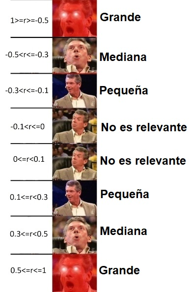

# Midiendo la asociación de dos numéricas: La Correlación

## Objetivo de la sesión

Explorar la relación entre dos variables numéricas. Específicamente vamos a entrar a una primera parte que es crucial para entender los temas posteriores, la cual consta de:

- Identificar si existe una relación lineal y reconocer el porqué.

- Medir la magnitud de esa relación. 


## Recordando: Plano cartesiano y diagrama de dispersión

El plano cartesiano es un sistema de coordenadas que se utiliza para representar y visualizar puntos en un espacio bidimensional.

Está compuesto por dos ejes perpendiculares, el eje horizontal o eje de las abscisas (X) y el eje vertical o eje de las ordenadas (Y). 

Estos ejes se cruzan en un punto llamado origen, que se representa con las coordenadas (0,0). Cada punto en el plano cartesiano se representa mediante un par ordenado (x, y), donde "x" indica la posición horizontal del punto a lo largo del eje X y "y" indica la posición vertical del punto a lo largo del eje Y. 
El plano cartesiano proporciona un marco de referencia visual que facilita la representación gráfica de datos, funciones matemáticas, relaciones y patrones geométricos, permitiendo el análisis y la interpretación de información en el contexto bidimensional.

Vamos a utilizar la siguiente información:

```{r}
pais<-c("Noruega","Chile", "Italia", "Peru", "Yemen")
democracy<-c(9.8,8.2,7.7,5.9,2.0)
corruption<-c(84,67,56,36,17)
data<-data.frame(pais, democracy,corruption)
data
```

Ahora lo visualizamos en un diagrama de dispersión, donde cada caso está representado por un punto en el plano:

```{r message=FALSE, warning=FALSE}
library(tidyverse)
library(ggrepel)
data |> 
  ggplot()+
  aes(x=democracy, y=corruption, label=pais)+
  geom_point() +
  geom_text_repel()+
  labs(x="Índice de democracia", 
       y="Índice de percepción de la Corrupción")+ 
  theme_light()
```


## Varianza

Recordarás que en las primeras clases vimos distintos estadísticos que servían para medir la dispersión de los datos. 

> Dispersión: Medida de cuánto se alejan los datos individuales de su valor central, lo cual proporciona información sobre la variabilidad de los datos.

Una de estas medidas era la varianza, la cual se definía como:


\[
\text{Var}(X) = \frac{1}{n} \sum_{i=1}^{n} (x_i - \bar{x})^2
\]

En resumen lo que hacíamos era calcular la suma de cuadrados de todas las diferencias (distancias) de las observaciones con la media de una determinada variable y, finalmente, calculábamos un promedio dependiendo del tamaño de la población. 

```{r}
var(data$democracy)
var(data$corruption)
```

**¿Recuerdas cuáles era la principal desventaja de la varianza y cuál era la alternativa que teníamos?**


## Covarianza

La covarianza es una medida que indica cómo varían dos variables de forma conjunta. 

Si vemos la fórmula vamos a encontrar algunas partes familiares:

\[
\text{Cov}(X, Y) = \frac{1}{n} \sum_{i=1}^{n} (x_i - \bar{x})(y_i - \bar{y})
\]

Forma de interpretarla:

- Una covarianza de cero indica que no hay una relación lineal entre las variables.

- Mientras más alejada de 0 esté la covarianza (mientras el número sea más grande) indica que las variables tienen una fuerte **relación lineal** y tienden a cambiar juntas en la misma dirección. 

> Relación lineal: Esto significa que los valores de una variable aumentan o disminuyen en correspondencia con los valores de la otra variable. 

- Si la covarianza es positiva, significa que las variables tienden a cambiar en la misma dirección. Si la covarianza es negativa, significa que las variables tienden a cambiar en direcciones opuestas.

**Recordemos ambos conceptos con unos ejemplos sencillos**


## Correlación  

### Definición

La correlación es una medida estadística que describe la relación o asociación entre dos variables. Indica la fuerza y la dirección de la relación lineal entre las variables y se mide a través de un coeficiente denominado coeficiente de correlación de Pearson.

La razón por la que explicamos arriba el tema de la **covarianza** es que podríamos decir que la correlación es la covarianza de dos variables normalizada en una escala de -1 a 1.

Para ello, se utiliza la siguiente fórmula:

\[
r = \frac{{\sum_{i=1}^{n}(x_i-\bar{x})(y_i-\bar{y})}}{{\sqrt{\sum_{i=1}^{n}(x_i-\bar{x})^2}\sqrt{\sum_{i=1}^{n}(y_i-\bar{y})^2}}}
\]

**Veamos el excel y calculemos**


### Interpretación


- Cuando el coeficiente de correlación es 1, existe una correlación positiva perfecta, lo que significa que a medida que una variable aumenta, la otra variable también lo hace de manera proporcional. 

- Por el contrario, cuando el coeficiente de correlación es -1, hay una correlación negativa perfecta, lo que implica que a medida que una variable aumenta, la otra variable disminuye de manera proporcional.

- Si el coeficiente de correlación es cercano a 0, indica una correlación débil o inexistente entre las variables, lo que significa que no hay una relación lineal clara entre ellas.


Ahora bien, normalmente no es común obtener -1, 1 o 0, sino diversos valores. Para ello, nos puede servir la escala de Cohen. 


Es decir, para nuestro caso, aplicaríamos lo siguiente:



## Validación con prueba de hipótesis 

La prueba de hipótesis en la correlación se utiliza para evaluar si existe una relación significativa entre dos variables continuas. Permite determinar si la correlación observada en una muestra es estadísticamente diferente de cero, lo que indicaría que existe una asociación entre las variables en la población subyacente.

En términos más específicos, la prueba de hipótesis en la correlación se basa en el coeficiente de correlación de Pearson (r) para evaluar si la correlación en la muestra es significativamente diferente de cero. Se establecen una hipótesis nula (H0) que asume que no hay correlación en la población, y una hipótesis alternativa (H1) que sugiere que hay una correlación significativa.

Al realizar la prueba de hipótesis, se calcula un valor de prueba (generalmente t o z) y se compara con un valor crítico basado en el nivel de significancia elegido. Con esa comparación, se concluye que hay evidencia suficiente para afirmar que existe una correlación significativa entre las variables.


### Paso 1: Establecer hipótesis

Debemos plantear las hipótesis nula y alternativa. 

Hipótesis  | Descripción 
------------- | ------------- 
Hipótesis nula  | No existe correlación lineal 
Hipótesis alterna  | Sí existe correlación lineal  


### Paso 2: Verificar supuestos

**DISTRITUCIÓN NORMAL**

Para los fines de este curso, asumimos que la variable numérica proviene de una distribución normal en la población. 


### Paso 3: Establecer nivel de significancia

Estamos trabajando a un 95% de confianza, por lo que nuestro nivel de significancia será 0.05.

$$\alpha = 0.05$$

### Paso 4: Calcular estadístico de prueba y p-valor

Para calcular la prueba de hipótesis utilizamos la función `cor.test`:

```{r}
cor.test(data$democracy, data$corruption)
```

### Paso 5: Tomar una decisión

Tenemos los siguientes escenarios

Resultado  | Decisión
------------- | -------------
$p-value <=\alpha$  | Rechazamos la hipótesis nula.
$p-value >\alpha$  | No rechazamos la hipótesis nula.


Habíamos escogido un $\alpha = 0.05$ por lo que al obtener un p-valor de 0.00644 rechazamos la hipótesis nula de que no existe correlación lineal en las variables elegidas.


### Paso 6: Interpretación

Ahora bien, al finalizar este proceso debemos interpretar nuestros resultados: 

**Luego de realizar una prueba de correlación, a un 95% de confianza, obtuvimos un p-valor de 0.00644, por lo que rechazamos la hipótesis nula de que existe correlaicón entre el nivel de percepción de la corrupción y el índice de democracia. Por ello, concluimos que sí una correlación estadísticamente significativa en las variables indicadas.**


