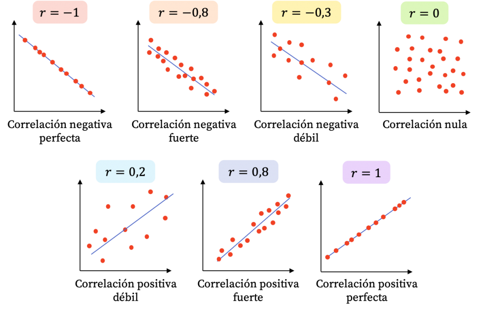

# Midiendo la asociación de dos numéricas: La Correlación

## Objetivo de la sesión

Explorar la relación entre dos variables numéricas. Específicamente vamos a entrar a una primera parte que es crucial para entender los temas posteriores, la cual consta de:

- Identificar si existe una relación lineal y reconocer el porqué.

- Medir la magnitud de esa relación. 


## Recordando: Plano cartesiano y diagrama de dispersión

El plano cartesiano es un sistema de coordenadas que se utiliza para representar y visualizar puntos en un espacio bidimensional.

Está compuesto por dos ejes perpendiculares, el eje horizontal o eje de las abscisas (X) y el eje vertical o eje de las ordenadas (Y). 

Estos ejes se cruzan en un punto llamado origen, que se representa con las coordenadas (0,0). Cada punto en el plano cartesiano se representa mediante un par ordenado (x, y), donde "x" indica la posición horizontal del punto a lo largo del eje X y "y" indica la posición vertical del punto a lo largo del eje Y. 
El plano cartesiano proporciona un marco de referencia visual que facilita la representación gráfica de datos, funciones matemáticas, relaciones y patrones geométricos, permitiendo el análisis y la interpretación de información en el contexto bidimensional.

Vamos a utilizar la siguiente información:

```{r}
pais<-c("Noruega","Chile", "Italia", "Peru", "Yemen")
democracy<-c(9.8,8.2,7.7,5.9,2.0)
corruption<-c(84,67,56,36,17)
data<-data.frame(pais, democracy,corruption)
data
```

Ahora lo visualizamos en un diagrama de dispersión, donde cada caso está representado por un punto en el plano:

```{r message=FALSE, warning=FALSE}
library(tidyverse)
library(ggrepel)
data |> 
  ggplot()+
  aes(x=democracy, y=corruption, label=pais)+
  geom_point() +
  geom_text_repel()+
  labs(x="Índice de democracia", 
       y="Índice de percepción de la Corrupción")+ 
  theme_light()
```


## Varianza

Recordarás que en las primeras clases vimos distintos estadísticos que servían para medir la dispersión de los datos. 

> Dispersión: Medida de cuánto se alejan los datos individuales de su valor central, lo cual proporciona información sobre la variabilidad de los datos.

Una de estas medidas era la varianza, la cual se definía como:


\[
\text{Var}(X) = \frac{1}{n} \sum_{i=1}^{n} (x_i - \bar{x})^2
\]

En resumen lo que hacíamos era calcular la suma de cuadrados de todas las diferencias (distancias) de las observaciones con la media de una determinada variable y, finalmente, calculábamos un promedio dependiendo del tamaño de la población. 

```{r}
var(data$democracy)
var(data$corruption)
```

**¿Recuerdas cuáles era la principal desventaja de la varianza y cuál era la alternativa que teníamos?**


## Covarianza

La covarianza es una medida que indica cómo varían dos variables de forma conjunta. 

Si vemos la fórmula vamos a encontrar algunas partes familiares:

\[
\text{Cov}(X, Y) = \frac{1}{n} \sum_{i=1}^{n} (x_i - \bar{x})(y_i - \bar{y})
\]

Forma de interpretarla:

- Una covarianza de cero indica que no hay una relación lineal entre las variables.

- Mientras más alejada de 0 esté la covarianza (mientras el número en valor absoluto sea más grande) indica que las variables tienen una fuerte **relación lineal** y tienden a cambiar juntas en la misma dirección. 

> Relación lineal: Esto significa que los valores de una variable aumentan o disminuyen en correspondencia con los valores de la otra variable. 

- Si la covarianza es positiva, significa que las variables tienden a cambiar en la misma dirección. Si la covarianza es negativa, significa que las variables tienden a cambiar en direcciones opuestas.

**Recordemos ambos conceptos con unos ejemplos sencillos**


## Coeficiente de Correlación de Pearson

### Definición

La correlación es una medida estadística que describe la relación o asociación entre dos variables. Indica la fuerza y la dirección de la relación lineal entre las variables y se mide a través de un coeficiente denominado coeficiente de correlación de Pearson.


El coeficiente de Pearson se llama así en honor a Karl Pearson, un estadístico británico que desarrolló este coeficiente de correlación en el siglo XIX. Karl Pearson fue una figura prominente en el campo de la estadística y realizó numerosas contribuciones a la teoría y aplicación de métodos estadísticos.

La razón por la que explicamos antes el tema de la **covarianza** es que podríamos decir que la correlación es la covarianza de dos variables normalizada en una escala de -1 a 1.

Para ello, se utiliza la siguiente fórmula:

\[
r = \frac{{\sum_{i=1}^{n}(x_i-\bar{x})(y_i-\bar{y})}}{{\sqrt{\sum_{i=1}^{n}(x_i-\bar{x})^2}\sqrt{\sum_{i=1}^{n}(y_i-\bar{y})^2}}}
\]

> Ojo con el numerador!

**Veamos el excel y calculemos**


### Interpretación



El coeficiente puede tomar los valores en el rango de -1 a 1. Con este podemos identificar dos caracterìsticas de la relación:

- **FUERZA**: Mientras el valor del coeficiente se aleje más del 0 (sea más grande como valor absoluto) ello indicará una mayor correlación entre las dos variables numéricas.

- **DIRECCIÓN**: Cuando el coeficiente tiene signo positivo, ello indicará que la relación tiene sentido directo, es decir, mientras una variable aumenta, la otra aumenta. Si el signo es negativo, mientras una variable aumenta la otra disminuye. 


EJEMPLOS:

- Cuando el coeficiente de correlación es 1, existe una correlación positiva perfecta, lo que significa que a medida que una variable aumenta, la otra variable también lo hace de manera proporcional. 

- Cuando el coeficiente de correlación es -1, hay una correlación negativa perfecta, lo que implica que a medida que una variable aumenta, la otra variable disminuye de manera proporcional.

- Si el coeficiente de correlación es cercano a 0, indica una correlación débil o inexistente entre las variables, lo que significa que no hay una relación lineal clara entre ellas.


Ahora bien, normalmente no es común obtener -1, 1 o 0, sino diversos valores. Para ello, nos puede servir la escala de Cohen, la cual  proporciona una escala para identificar un valor numérico con una magnitud de la correlaciòn. No obstante, esta es referencial, será común encontrar otras escalas dependiendo del campo de estudio. 


Es decir, para nuestro caso, aplicaríamos lo siguiente:


## Validación con prueba de hipótesis 

La prueba de hipótesis en la correlación se utiliza para evaluar si existe una relación significativa entre dos variables continuas. Permite determinar si la correlación observada en una muestra es estadísticamente diferente de cero, lo que indicaría que existe una asociación entre las variables en la población subyacente.

En términos más específicos, la prueba de hipótesis en la correlación se basa en el coeficiente de correlación de Pearson (r) para evaluar si la correlación en la muestra es significativamente diferente de cero. Se establecen una hipótesis nula (H0) que asume que no hay correlación en la población, y una hipótesis alternativa (H1) que sugiere que hay una correlación significativa.

Al realizar la prueba de hipótesis, se calcula un valor de prueba (generalmente t o z) y se compara con un valor crítico basado en el nivel de significancia elegido. Con esa comparación, se concluye que hay evidencia suficiente para afirmar que existe una correlación significativa entre las variables.


### Paso 1: Establecer hipótesis

Debemos plantear las hipótesis nula y alternativa. 

Hipótesis  | Descripción 
------------- | ------------- 
Hipótesis nula  | No existe correlación lineal 
Hipótesis alterna  | Sí existe correlación lineal  


### Paso 2: Verificar supuestos

**DISTRITUCIÓN NORMAL**

Para los fines de este curso, asumimos que la variable numérica proviene de una distribución normal en la población. 


### Paso 3: Establecer nivel de significancia

Estamos trabajando a un 95% de confianza, por lo que nuestro nivel de significancia será 0.05.

$$\alpha = 0.05$$

### Paso 4: Calcular estadístico de prueba y p-valor

Para calcular la prueba de hipótesis utilizamos la función `cor.test`:

```{r}
cor.test(data$democracy, data$corruption)
```

### Paso 5: Tomar una decisión

Tenemos los siguientes escenarios

Resultado  | Decisión
------------- | -------------
$p-value <=\alpha$  | Rechazamos la hipótesis nula.
$p-value >\alpha$  | No rechazamos la hipótesis nula.


Habíamos escogido un $\alpha = 0.05$ por lo que al obtener un p-valor de 0.00644 rechazamos la hipótesis nula de que no existe correlación lineal en las variables elegidas.


### Paso 6: Interpretación

Ahora bien, al finalizar este proceso debemos interpretar nuestros resultados: 

**Luego de realizar una prueba de correlación, a un 95% de confianza, obtuvimos un p-valor de 0.00644, por lo que rechazamos la hipótesis nula de que existe correlaicón entre el nivel de percepción de la corrupción y el índice de democracia. Por ello, concluimos que sí una correlación estadísticamente significativa en las variables indicadas.**


## Toma nota

### Correlación no implica causalidad


El principio de "correlación no implica causalidad" es un concepto fundamental en estadística y metodología de investigación que establece que el hecho de que dos variables estén correlacionadas entre sí no significa necesariamente que exista una relación causal directa entre ellas. En otras palabras, solo porque dos variables muestren una asociación estadística, no se puede concluir automáticamente que una variable cause los cambios en la otra.

Un ejemplo comúnmente citado para ilustrar este principio es la relación entre el consumo de helado y el número de casos de ahogamiento en piscinas. Estos dos fenómenos pueden estar correlacionados, es decir, puede haber una asociación estadística entre ellos. Durante los meses de verano, tanto el consumo de helado como el uso de piscinas aumentan. Por lo tanto, si se analizan los datos, es posible encontrar una correlación positiva entre la cantidad de helado consumido y el número de casos de ahogamiento en piscinas.

Sin embargo, sería incorrecto concluir que el consumo de helado causa los casos de ahogamiento en piscinas. En realidad, ambos fenómenos están influenciados por un factor común, que es la temporada de verano. El aumento en el consumo de helado y el uso de piscinas se debe a las altas temperaturas y el clima cálido propios del verano, y no a una relación causal directa entre ambas variables.

Este ejemplo ilustra cómo dos variables pueden estar correlacionadas sin que exista una relación causal entre ellas. Para establecer una relación causal, es necesario realizar estudios más rigurosos que consideren otros factores y utilicen diseños de investigación adecuados, como experimentos controlados o análisis de series temporales.

Te invito a que visites esta página web con un conjunto de correlaciones espurias interesantes:

https://www.tylervigen.com/spurious-correlations

> Las correlaciones espurias pueden surgir cuando dos variables están relacionadas indirectamente a través de un tercer factor común, lo que crea la ilusión de una asociación directa entre ellas. Estas asociaciones pueden ser engañosas si no se consideran cuidadosamente los factores confusores o variables de control en el análisis.


### Cuidado: Scatterplot como primer paso SIEMPRE

Vamos a crear la siguiente data:

```{r}
# Sólo con fines de ejemplo.
peq = function(x) x^3+2*x^2+5
x = seq(-0.99, 1, by = .01)
y = peq(x) + runif(200)
df = data.frame(x = x, y = y)
head(df,5)
```

Ahora, vamos a generar nuestro cor.test entre las dos variables. Qué concluimos?

```{r}
cor.test(df$x,df$y)
```

```{r message=FALSE, warning=FALSE}
library(tidyverse)
# df |> 
#   ggplot()+
#   aes(x=x, y=y)+
#   geom_point() 
```

Mientras que una prueba de correlación lineal, como el coeficiente de correlación de Pearson, mide la relación lineal entre variables, puede haber relaciones no lineales entre las variables. Un diagrama de dispersión permite observar patrones más complejos y no lineales, como relaciones parabólicas, curvas en forma de S u otras formas.

**Si aplicamos un cor.test sin analizar previamente las variables podríamos llegar a conclusiones equivocadas**

El coeficiente de correlación de Pearson es una medida estadística que evalúa la relación lineal entre dos variables. Sin embargo, puede haber situaciones en las que exista una relación no lineal entre las variables, pero el coeficiente de Pearson aún pueda ser significativo y mostrar una correlación fuerte. 

Un escenario es el ejemplo mostrado en el que existe una relación monótona.  Una relación monótona es aquella en la que las variables aumentan o disminuyen juntas, pero no necesariamente de manera lineal. En estos casos, el coeficiente de Pearson aún puede mostrar una correlación fuerte porque refleja la tendencia general de las variables, a pesar de que la relación subyacente no sea lineal.


### Valores extremos


La presencia de valores extremos en los datos puede afectar el resultado del cor.test y, en algunos casos, cambiar la interpretación de la correlación.

El coeficiente de correlación de Pearson, que se calcula mediante cor.test en R, es sensible a los valores extremos debido a su influencia en la covarianza entre las variables. Los valores extremos pueden distorsionar la relación entre las variables y afectar la magnitud y significancia del coeficiente de correlación.

Cuando se presentan valores extremos, existen algunas consideraciones a tener en cuenta:

- Influencia en la magnitud de la correlación: Un valor extremo atípico puede tener un impacto desproporcionado en la correlación, especialmente si está alejado de la tendencia general de los datos. Dependiendo de la dirección y magnitud del valor atípico, puede aumentar o disminuir la correlación observada. Por lo tanto, es importante tener en cuenta que una correlación fuerte obtenida a partir de un cor.test puede ser influenciada por valores extremos.

- Influencia en la significancia estadística: Los valores extremos pueden aumentar la varianza y la covarianza en los datos, lo que a su vez puede afectar la significancia estadística del coeficiente de correlación. En presencia de valores atípicos, el p-valor asociado al cor.test puede cambiar y volverse más o menos significativo, dependiendo del efecto de los valores extremos en la correlación.

Por lo tanto, es importante identificar y evaluar la influencia de los valores extremos en el análisis de correlación y considerarlos al interpretar los resultados. Si los valores extremos son atípicos y no representativos de la población o el fenómeno en estudio, se pueden considerar métodos alternativos de análisis, como el uso de técnicas robustas o el análisis de subgrupos sin los valores extremos.


### Tamaño de la muestra

El tamaño de la muestra puede afectar la interpretación de la correlación. Las correlaciones pueden ser más confiables y representativas cuando se basan en muestras grandes en lugar de muestras pequeñas. Es importante considerar la confiabilidad estadística de la correlación al interpretar los resultados.


