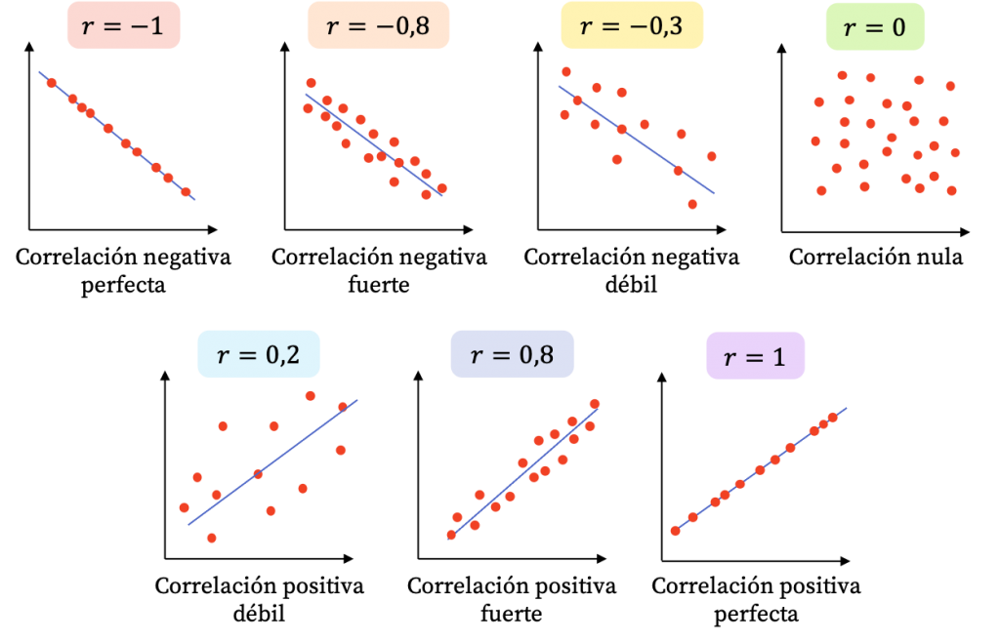
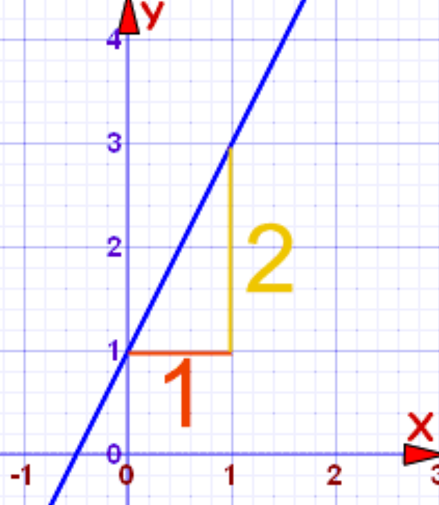
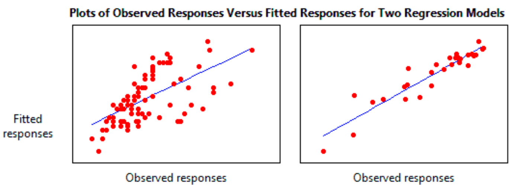
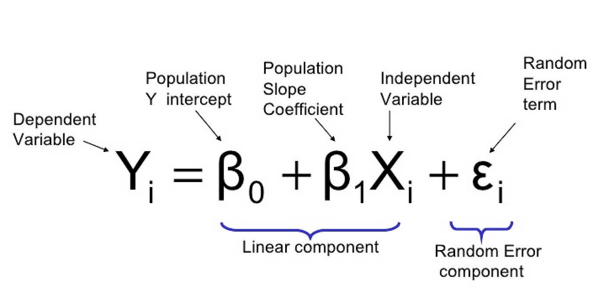
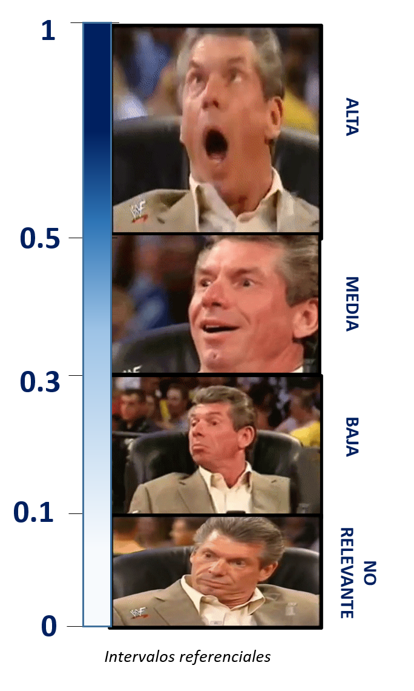
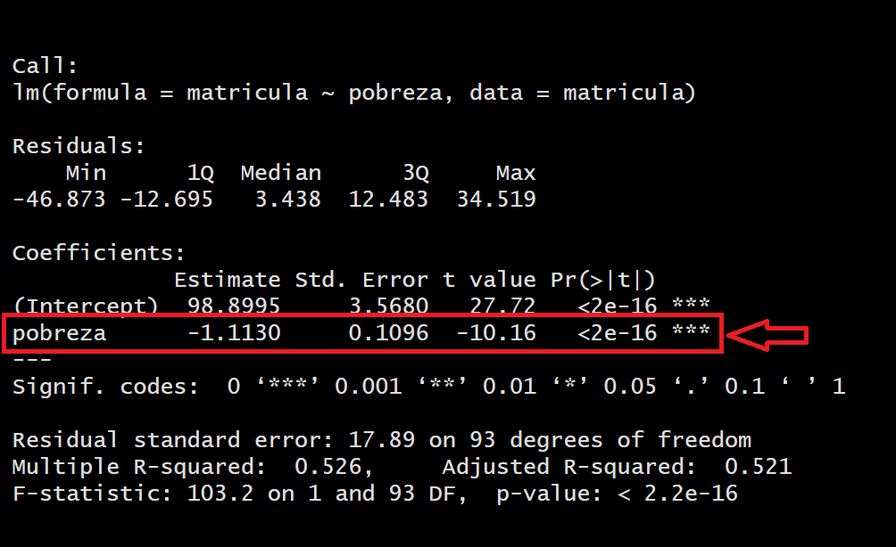

# Regresión lineal simple: explicar y predecir

## Objetivo de la sesión

Introducir a los estudiantes en el concepto y la aplicación de la regresión lineal, que es una técnica estadística utilizada para modelar y analizar la relación entre una variable dependiente y una variable independiente.

Se abordarán los siguientes temas:

- Concepto de regresión lineal

- Modelado

- Interpretación de los resultados


## Pregunta de investigación

Qué factores explican la variabilidad en el porcentaje anual de matrícula escolar a nivel secundaria por país?

Contamos con las siguientes variables:

- Porcentaje de inscripción escolar neta por país

- PBI per cápita por país

- Porcentaje de la población que se encuentra por debajo de la línea de pobreza por país

- Porcentaje de población urbana por país

- Porcentaje de población femenina por país

- Porcentaje de inversión del Estado en Educación por país

- Proporción de estudiantes con relación al número de maestros por país

- Porcentaje de jóvenes entre 15-19 años que son consumidores de alcohol por país

- Tasa de natalidad adolescente (por 1000 mujeres de 15 a 19 años) pos país


```{r echo=TRUE, message=FALSE, warning=FALSE}
library(haven)
library(tidyverse)
library(rio)
matricula<-import("https://github.com/ChristianChiroqueR/banco_de_datos/raw/main/DATA_internacional/matricula.xlsx")
colnames(matricula)<-c("pais","matricula","pbiPC","pobreza","urbano","gastoeducacion","ratio_prof","alcohol","natalidad_ado")
```


## Recordando

### Coeficiente de Correlación de Pearson

Habíamos visto que la correlación es una medida estadística que describe la relación o asociación entre dos variables. Indica la fuerza y la dirección de la relación lineal entre las variables y se mide a través de un coeficiente denominado coeficiente de correlación de Pearson.




El coeficiente puede tomar los valores en el rango de -1 a 1. Con este podemos identificar dos caracterìsticas de la relación:

- **FUERZA**: Mientras el valor del coeficiente se aleje más del 0 (sea más grande como valor absoluto) ello indicará una mayor correlación entre las dos variables numéricas.

- **DIRECCIÓN**: Cuando el coeficiente tiene signo positivo, ello indicará que la relación tiene sentido directo, es decir, mientras una variable aumenta, la otra aumenta. Si el signo es negativo, mientras una variable aumenta la otra disminuye. 


Es decir, para nuestro caso, aplicaríamos lo siguiente:


### ¡Ahora hazlo tú!

En base a la data presentada vamos a considerar que deseamos explicar el fenómeno de la "Porcentaje de inscripción escolar neta por país". 

```{r}
head(matricula,5)
```

Para ello vamos a:

- Calcular las correlaciones individuales entre "matricula" y el resto de variables, utilizando cor.test(). Rápidamente mencionen si encontraron correlaciones significativas.

- Calcule la matriz de correlaciones y genere un gráfico. Qué podría afirmar a nivel general de la data presentada?


## Introducción a la Regresión Lineal Simple


La regresión lineal simple es una técnica estadística que busca modelar la relación entre dos variables: una variable dependiente y una variable independiente. 

La idea principal es encontrar una **línea recta que mejor se ajuste a los datos observados**, de manera que se pueda predecir o estimar el valor de la variable dependiente en función del valor de la variable independiente.

Vamos por partes:


### Variable dependiente y variable independiente

A diferencia de la correlación, en este caso sí afirmamos que existe dependencia entre las variables. 
En estadística, los términos "variable dependiente" y "variable independiente" se utilizan para describir las diferentes categorías de variables en un estudio o análisis. Estas categorías se basan en la relación y el papel que desempeñan en el análisis estadístico.

La variable dependiente es aquella que se estudia o analiza para determinar cómo es afectada o influenciada por otras variables. También se conoce como variable de respuesta o variable de interés. En un análisis de regresión, por ejemplo, la variable dependiente es la que se trata de predecir o explicar a partir de otras variables. Es común representarla en el eje vertical de un gráfico de dispersión o en la fórmula del modelo estadístico con el símbolo Y.

Por otro lado, las variables independientes son aquellas que se consideran como posibles explicaciones o factores que pueden influir en la variable dependiente. También se conocen como variables predictoras o variables explicativas. Estas variables se manipulan o se observan en el estudio con el propósito de analizar su relación con la variable dependiente. En un análisis de regresión, las variables independientes son utilizadas para predecir o explicar los cambios en la variable dependiente. Se suelen representar en el eje horizontal de un gráfico o en la fórmula del modelo estadístico con la letra X.

RECUERDA  | 
------------- | 
La variable dependiente es la que se estudia o analiza para determinar su relación con otras variables, mientras que las variables independientes son las que se utilizan para explicar o predecir los cambios en la variable dependiente.  | 


### Flashback: Ecuación de la recta

En la regresión lineal simple, se asume que la relación entre las variables puede ser aproximada por una línea recta en el espacio bidimensional. Para ello debemos acordarnos algunos elementos básicos:


$$
Y = \beta_0 + \beta_1X
$$
Donde:

Y es la variable dependiente que se quiere predecir o estimar.

X es la variable independiente que se utiliza para predecir Y.

β₀ es la intersección de la línea (ordenada al origen).

β₁ es la pendiente de la línea (indica cuánto varía Y por cada unidad de X).


Tener en cuenta que si:

- Si β₁ es positivo, Y aumenta cuando X aumenta.Es una relación directa / positiva.

- Si β₁ es negativo, Y aumenta cuando X disminuye.Es una relación inversa / negativa.

- Si β₁ es cero.Y no cambia cuando X varía. No existe relación entre las variables.


**EJEMPLO**



Para calcular la ecuación nos preguntamos:

¿En qué punto la línea cruza el eje Y? (intercepto)

**Vemos que la recta atraviesa el eje Y en el número 1**


Por cada unidad de X, ¿cuánto varía el valor de Y? (pendiente)

**Cada vez que X aumenta en una unidad, Y varía en dos unidades**


Entonces nuestra ecuación será:

$$
Y = 1 + 2X
$$


**Realicemos algunos ejercicios!!!**


### La mejor recta para la nube de puntos




Ahora bien, utilizando el concepto de la ecuación lineal de la recta, podemos entender mejor lo que hace una regresión. 

El propósito de la regresión lineal es encontrar una línea que **se ajuste** mejor a la nube de puntos que habíamos identificado anteriormente en el gráfico de dispersión. 

Para ello definimos un modelo que agrega un elemento más a la ecuación de la recta que ya habíamos visto antes:



En este caso vemos que al último ha aparecido un nuevo elemento, el **error aleatorio**.


Formalmente debemos decir que ε es el término de error que representa la variación no explicada por el modelo. En otras palabras, el ε es la acumulación de las distancias de los puntos a la línea recta construida. 


### La Regresión Lineal

El objetivo de la regresión lineal simple es estimar los coeficientes β₀ y β₁ a partir de los datos observados, de manera que la línea ajustada se aproxime lo mejor posible a los valores reales de la variable dependiente. Esta estimación se realiza utilizando el método de mínimos cuadrados, que busca minimizar la suma de los errores al cuadrado entre los valores observados y los valores predichos por el modelo (dónde antes habías visto la necesidad de elevar al cuadrado una resta? Por qué y para qué?).

Una vez que se ha ajustado el modelo de regresión lineal simple, se pueden realizar inferencias y hacer predicciones sobre los valores de la variable dependiente para diferentes valores de la variable independiente. 


Regresión Lineal Simple  | 
------------- | 
Técnica que permite modelar y analizar la relación lineal entre dos variables, proporcionando una forma de estimar y predecir valores de la variable dependiente en función de la variable independiente.  | 


### Calidad de ajuste: R2 

El coeficiente de determinación (R²) en regresión es una medida estadística que indica la proporción de la varianza de la variable dependiente (Y) que puede explicarse por la variable independiente (X) en el modelo de regresión. En otras palabras, el R² representa la cantidad de variabilidad en los valores de Y que es capturada por el modelo de regresión.

El valor de R² varía entre 0 y 1. Un R² de 0 significa que el modelo no explica ninguna variabilidad en Y, mientras que un R² de 1 indica que el modelo explica toda la variabilidad en Y. En general, un valor de R² más cercano a 1 indica un mejor ajuste del modelo y una mayor capacidad de explicar la variabilidad observada en la variable dependiente.

Para nuestros fines seguiremos utilizando de referencia la escala de Cohen:



Sin embargo, es importante tener en cuenta que el R² por sí solo no indica la validez o la relevancia del modelo de regresión. Es necesario considerar otros aspectos, como la significancia estadística de los coeficientes, los supuestos del modelo y el contexto del problema, para evaluar completamente la calidad del ajuste del modelo.


### Significancia estadística de los coeficientes 

La significancia estadística de los coeficientes en un modelo de regresión se refiere a la pregunta de si los coeficientes estimados son estadísticamente diferentes de cero o no. En otras palabras, se evalúa si hay evidencia suficiente en los datos para afirmar que la relación entre la variable independiente y la variable dependiente es real y no se debe simplemente al azar.

Para ello, se realizan pruebas de hipótesis por cada uno de los coeficientes calculados. En este caso, al ser regresión lineal sólo tenemos un coeficiente (β₁). Por ello, planteamos las siguientes hipótesis:


Hipótesis  | Descripción 
------------- | ------------- 
Hipótesis nula  | La variable X1 no aporta al modelo propuesto 
Hipótesis alterna  | La variable X1 sí aporta al modelo propuesto  


Para determinar la significancia estadística, se utiliza un valor de p, que indica la probabilidad de obtener un resultado igual o más extremo que el observado, asumiendo que la hipótesis nula es verdadera (la hipótesis nula generalmente establece que no hay relación entre las variables). Si el valor de p es menor que un umbral predeterminado (por ejemplo, 0.05), se considera que el coeficiente es estadísticamente significativo, lo que significa que hay suficiente evidencia para rechazar la hipótesis nula y concluir que el coeficiente es diferente de cero.

En resumen, la significancia estadística de los coeficientes nos permite determinar si los efectos estimados en el modelo son estadísticamente confiables y si podemos inferir que existe una relación real entre las variables independientes y la variable dependiente en la población de interés.


### La RLS como herramienta predictiva

La regresión lineal no solo se utiliza para explicar la relación entre una variable dependiente y una o más variables independientes, sino que también puede ser una herramienta poderosa para la predicción. A través del modelo de regresión lineal ajustado, es posible utilizar las variables independientes para predecir el valor de la variable dependiente en nuevos casos o situaciones.

Una vez que se ha ajustado el modelo de regresión lineal con datos de entrenamiento, se puede utilizar este modelo para realizar predicciones en datos no vistos. Para ello, se ingresan los valores de las variables independientes en el modelo y se obtiene una estimación del valor de la variable dependiente correspondiente.

Esta capacidad predictiva puede ser especialmente útil en diversas aplicaciones, como pronósticos económicos, estimación de ventas, predicción de precios, análisis de tendencias, entre otros. Sin embargo, es importante tener en cuenta las limitaciones y supuestos del modelo de regresión lineal, así como la calidad de los datos utilizados para el ajuste del modelo, ya que esto puede afectar la precisión y validez de las predicciones.

Es fundamental realizar una evaluación adecuada de la calidad del modelo y validar las predicciones utilizando técnicas como la validación cruzada o la división de datos en conjuntos de entrenamiento y prueba. Además, en algunos casos, puede ser necesario utilizar técnicas más avanzadas, como modelos de regresión no lineal o modelos de regresión con variables transformadas, para obtener predicciones más precisas en situaciones donde la relación entre las variables no es lineal.


## Matrícula escolar: un modelo utilizando RLS

### Paso 0: Identificar claramente la variable dependiente y la variable independiente

DEPENDIENTE | INDEPENDIENTE
------------- | -------------
Matrícula escolar  | Pobreza


### Paso 1: Explorar previamente la relación de las variables

Veamos nuevamente lo encontrado en la exploración realizada hace unos momentos. En este caso centrémonos en la relación entre Matrícula Escolar y Nivel de Pobreza. 


```{r}
matricula |> 
  ggplot()+
  aes(x=pobreza, y=matricula)+
  geom_point()
```

```{r}
cor.test(matricula$matricula, matricula$pobreza)
```

Interpretemos de acuerdo a lo visto en la clase anterior. 


### Paso 2: Planteamos el modelo y verificamos si es válido con ANOVA

Para generar el modelo podemos utilizar la función `lm()`. Te sugiero que revises la documentación del R para que sepas qué argumentos utiliza esta función. 

```{r}
modelo1 <- lm(matricula~pobreza, data=matricula)
```

Ahora probamos su validez con la técnica ANOVA. El análisis de varianza (ANOVA) se utiliza en la regresión lineal para evaluar la significancia estadística del modelo en su conjunto y determinar si hay una relación significativa entre las variables independientes y la variable dependiente.

En el contexto de la regresión lineal, el ANOVA compara la variabilidad explicada por el modelo (la suma de cuadrados de la regresión) con la variabilidad no explicada (la suma de cuadrados del error). Si la variabilidad explicada es significativamente mayor que la variabilidad no explicada, esto indica que el modelo es estadísticamente significativo y que las variables independientes tienen un impacto significativo en la variable dependiente.

El ANOVA proporciona información sobre la calidad general del modelo, indicando si el modelo en su conjunto es útil para predecir o explicar la variable dependiente. 

Hipótesis  | Descripción 
------------- | ------------- 
Hipótesis nula  | El modelo de regresión no es válido 
Hipótesis alterna  | El modelo de regresión es válido  


```{r}
anova(modelo1)
```

En este caso, al obtener un p-valor menor al alpha (0.05) podemos rechazar la hipótesis nula, concluyendo que nuestro modelo sí es válido. 

Ojo, si revisas la bibliografía estadística es probable que no encuentres la hipótesis nula planteada de la manera expuesta, sino más bien como "los coeficientes son distintos de 0". 


### Paso 3: Nivel explicativo del modelo

Habíamos dicho que el R2 indica la proporción de la varianza de la variable dependiente (Y) que puede explicarse por la variable independiente (X) en el modelo de regresión. 

```{r}
summary(modelo1)
```


Hemos obtenido un R2 de 0.526 por lo que concluimos:

- Un coeficiente de determinación (r cuadrado) de 0.52 indica que aproximadamente el 52% de la variabilidad de la variable dependiente puede ser explicada por las variables independientes incluidas en el modelo de regresión. Esto significa que alrededor del 52% de las fluctuaciones en los valores observados de la variable dependiente pueden ser atribuidas a las variables independientes utilizadas en el modelo. Cuanto más cercano esté el valor de r cuadrado a 1, mayor será la proporción de la variabilidad explicada por el modelo y mejor será el ajuste del modelo a los datos.

- Es importante tener en cuenta que un r cuadrado de 0.52 también implica que aproximadamente el 48% de la variabilidad de la variable dependiente no está explicada por las variables independientes incluidas en el modelo. Esta variabilidad restante puede ser atribuida a otros factores no considerados en el modelo o al azar!!

- Siguiendo nuestro intervalo, diremos que el modelo tiene un **ALTO** nivel explicativo. 


### Paso 4: La variable x aporta al modelo


En este paso exploramos la significancia de los coeficientes de las X. En este caso al tener sólo una independiente (Pobreza), sólo tenemos un coeficiente. 




Hipótesis  | Descripción 
------------- | ------------- 
Hipótesis nula  | La variable X1 no aporta al modelo propuesto 
Hipótesis alterna  | La variable X1 sí aporta al modelo propuesto  


En este caso, para la variable Pobreza, al obtener un p-valor menor al alpha (0.05) podemos rechazar la hipótesis nula, concluyendo que efectivamente SÍ aporta al modelo para explicar el nivel de matrícula escolar en el mundo. 


### Paso 5: Construimos la ecuación del modelo creado


$$
Matrícula = 98.8995 + -1.1130 * Pobreza
$$
La ecuación de regresión permite predecir los valores de la variable dependiente para nuevos valores de la variable independiente. Puedes usar la ecuación para estimar cómo cambiará la variable dependiente en función de los cambios en la variable independiente. Esto es especialmente útil en problemas de pronóstico o en la estimación de resultados futuros


```{r}
#library(ggpmisc)
matricula |> 
  ggplot()+
  aes(x=pobreza, y=matricula)+
  geom_point(aes(color = "red")) + 
  geom_smooth(method = "lm",se = FALSE)
```


