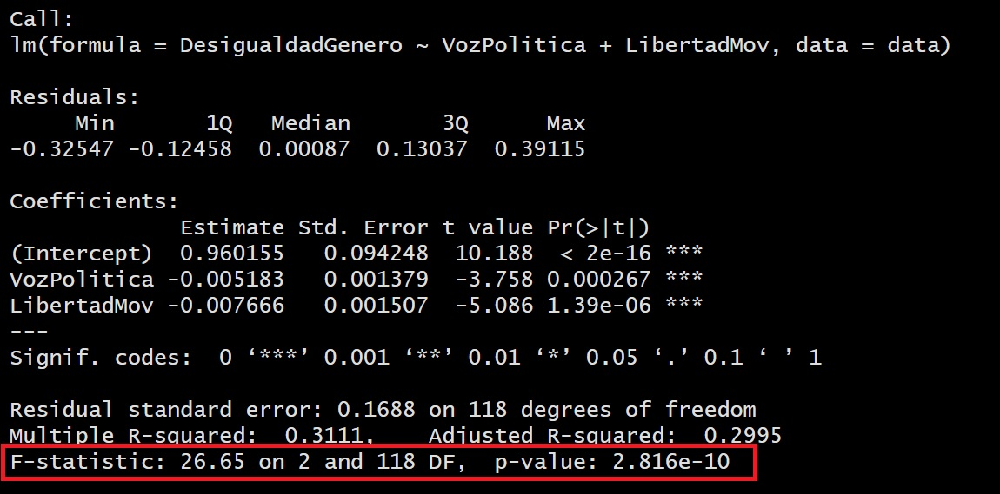
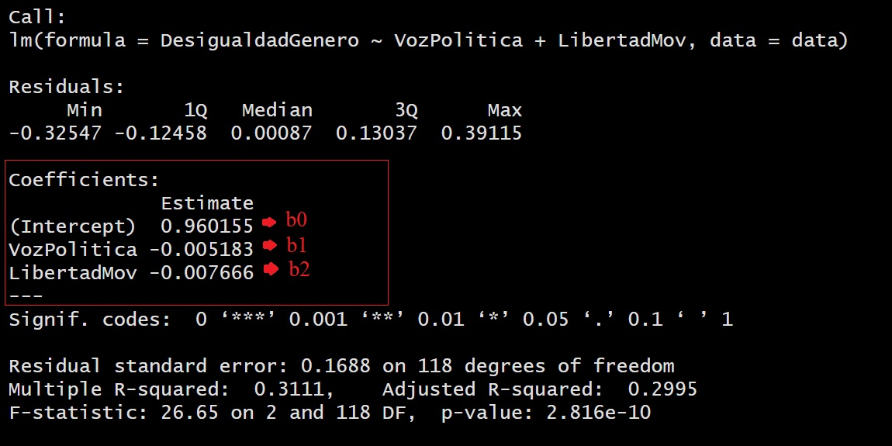

# Regresión lineal múltiple: más de una independiente

## Objetivo de la sesión

Se abordarán los siguientes temas:

- Concepto de regresión lineal múltiple

- Modelado

- Interpretación de los resultados

- Predicción


## Regresión Lineal Múltiple

La regresión lineal múltiple es una técnica estadística que tiene como objetivo modelar la relación entre una variable de interés (variable dependiente) y múltiples variables predictoras (variables independientes). Se fundamenta en la suposición de que la variable dependiente puede ser aproximada mediante una combinación lineal de las variables predictoras, con la inclusión de un término de error aleatorio.

### Ecuación

En la regresión lineal múltiple, se estima una ecuación de la forma:

$$
Y = \beta_0 + \beta_1X_1 + \beta_2X_2 + ... + \epsilon
$$
Donde:

Y es la variable dependiente que se desea predecir.

X₁, X₂, ..., Xₚ son las variables predictoras.

β₀, β₁, β₂, ..., βₚ son los coeficientes de regresión que representan la contribución de cada variable predictora.

ε es el término de error aleatorio, que captura la variabilidad no explicada por las variables predictoras.


El objetivo de la regresión lineal múltiple es encontrar los valores óptimos de los coeficientes de regresión de manera que se minimice la discrepancia entre los valores observados y los valores predichos. Esto posibilita la obtención de un modelo que pueda ser empleado para hacer predicciones y comprender la relación entre las variables involucradas.


### Mayor complejidad para visualizar la relación


La representación gráfica de una regresión lineal múltiple puede volverse más desafiante debido a la presencia de múltiples variables predictoras. En un gráfico bidimensional, solo podemos mostrar dos variables a la vez, lo que limita nuestra capacidad para observar cómo todas las variables predictoras se relacionan con la variable dependiente de manera simultánea. Además, las representaciones gráficas tradicionales, como los diagramas de dispersión, pueden volverse complicadas cuando tratamos de incorporar más de dos variables, ya que no es sencillo visualizarlas en un solo plano.

Para abordar esta complejidad, existen enfoques alternativos que pueden resultar útiles, como los gráficos de pares (scatterplot matrix), que permiten visualizar las relaciones entre pares de variables predictoras y la variable dependiente de manera más clara. También se pueden emplear técnicas de visualización más avanzadas, como gráficos tridimensionales o visualizaciones interactivas, que facilitan la exploración de las relaciones entre múltiples variables de forma más completa y comprensible.

Para cuatro o más variables predictoras, el modelo de regresión lineal múltiple sigue siendo válido y útil, pero la visualización directa se vuelve más complicada debido a la alta dimensionalidad del espacio de variables. En lugar de tratar de visualizar el hiperplano, los análisis se centran en entender las relaciones y realizar inferencias basadas en los coeficientes estimados del modelo.


## Pregunta de investigación

¿Qué factores explican la desigualdad de género en el país?

Contamos con las siguientes variables:


```{r echo=TRUE, message=FALSE, warning=FALSE}
library(tidyverse)
library(rio)
data<-import("https://github.com/ChristianChiroqueR/banco_de_datos/raw/main/DATA_internacional/desigualdad.xlsx")
```


## Ejercicio 1: Explicando la desigualdad con RLM


### Paso 0: Identificar claramente la variable dependiente y laS variables independientes


DEPENDIENTE | INDEPENDIENTES
------------- | -------------
Desigualdad de género  | Voz Política y Libertad de Movimiento


### Paso 1: Explorar previamente la relación de las variables

Entre Desigualdad de género y Voz Política

```{r}
data |> 
  ggplot()+
  aes(x=VozPolitica, y=DesigualdadGenero)+
  geom_point()
```

```{r}
cor.test(data$DesigualdadGenero, data$VozPolitica)
```

Ahora con Desigualdad de género y Libertad de Movimiento


```{r}
data |> 
  ggplot()+
  aes(x=LibertadMov, y=DesigualdadGenero)+
  geom_point()
```
```{r}
cor.test(data$DesigualdadGenero, data$LibertadMov)
```

Te acuerdas que te había dicho que las relaciones entre más de 2 variables se volvía más compleja de analizar y visualizar? Realicemos un gráfico 3d de la relación de las tres variables escogidas. 


```{r message=FALSE, warning=FALSE}
library(plotly)
plot_ly(x = data$DesigualdadGenero, y = data$VozPolitica, z = data$LibertadMov, text=rownames(data),type = "scatter3d", mode = "markers")
```

> Este gráfico sólo se puede aplicar con tres variables!


### Paso 2: ¿Nuestro modelo es válido?

Para generar el modelo podemos utilizar la función `lm()`.  

```{r}
modelo1 <- lm(DesigualdadGenero~VozPolitica + LibertadMov, data=data)
```

Ahora probamos su validez con la técnica ANOVA. 

El ANOVA proporciona información sobre la calidad general del modelo, indicando si el modelo en su conjunto es útil para predecir o explicar la variable dependiente. 

Hipótesis  | Descripción 
------------- | ------------- 
Hipótesis nula  | El modelo de regresión no es válido 
Hipótesis alterna  | El modelo de regresión es válido  

```{r}
#summary(modelo1)
```



En este caso, al obtener un p-valor menor al alpha (0.05) podemos rechazar la hipótesis nula, concluyendo que nuestro modelo sí es válido. 

Ojo, si revisas la bibliografía estadística es probable que no encuentres la hipótesis nula planteada de la manera expuesta, sino más bien como "los coeficientes son distintos de 0". 


### Paso 3: ¿Qué tanto explica mi modelo?

Habíamos dicho que el R2 indica la proporción de la varianza de la variable dependiente (Y) que puede explicarse por la variable independiente (X) en el modelo de regresión. 

Ello lo podemos visualizar en el mismo output:


Habíamos aprendido a ver el R2 Múltiple, en ese caso nos indicaría que un 31% de la variabilidad de la Desigualdad de Género es explicada por la Voz Política y la Libertad de Movimiento.

Sin embargo, en este caso se utiliza el R2 ajustado:


Siguiendo nuestro intervalo, diremos que el modelo tiene un **BAJO** nivel explicativo, daod que el R2 ajustado es de 0.2995  (29.95% de la variabilidad de Y es explicada por nuestras X´s)


### Paso 4: ¿Las variables X aportan al modelo? ¿Cuál es la más importante?

En este paso exploramos la significancia de los coeficientes de las X. 

En este caso al tener dos independientes (Voz Política y Libertad de Movimiento), tenemos dos coeficientes. 


Hipótesis  | Descripción 
------------- | ------------- 
Hipótesis nula  | La variable X1 no aporta al modelo propuesto 
Hipótesis alterna  | La variable X1 sí aporta al modelo propuesto  


En este caso, tanto para la variable Voz Política como Libertad de Movimiento, al obtener un p-valor menor al alpha (0.05) podemos rechazar la hipótesis nula, concluyendo que efectivamente que SÍ aportan poder explicativo al modelo para explicar el nivel de desigualdad de género en el mundo. 


### Paso 5: ¿Cuál es la ecuación del modelo?


Entonces siguiendo la fórmula de la Regresión Lineal Múltiple:

$$
Y = \beta_0 + \beta_1X_1 + \beta_2X_2
$$

Reemplazamos con los coeficientes calculados:

Entonces siguiendo la fórmula de la Regresión Lineal Múltiple:

$$
DesigualdadGenero = 0.96 + (-0.005*VozPolitica) + (-0.007*LibertadMov)
$$
$$
DesigualdadGenero = 0.96  - (0.005*VozPolitica) - (0.007*LibertadMov)
$$
La ecuación de regresión permite predecir los valores de la variable dependiente para nuevos valores de la variable independiente. 


## Tabla para comparar modelos (stargazer)

El paquete `stargazer` en R es una herramienta útil para comparar modelos de regresión lineal múltiple de manera concisa y organizada. Proporciona una forma conveniente de generar tablas resumidas que muestran los resultados de varios modelos de regresión en una presentación fácil de leer.

Algunas de las utilidades del paquete "stargazer" son:

- Comparación de modelos: Permite comparar los resultados de diferentes modelos de regresión lineal múltiple en una sola tabla. Esto facilita la identificación de las diferencias en los coeficientes, errores estándar, estadísticas de ajuste y otros estadísticos de interés entre los modelos.

- Personalización de la presentación: El paquete ofrece varias opciones de formato y estilo para personalizar la apariencia de la tabla generada. Es posible ajustar el alineamiento, agregar títulos, etiquetas y notas a las tablas, lo que facilita la presentación de los resultados de manera clara y ordenada.

- Exportación a diferentes formatos: El resultado de "stargazer" se puede exportar a diferentes formatos, como HTML, LaTeX, texto o incluso Excel, lo que facilita su inclusión en informes, presentaciones o documentos científicos. **También lo puedes incluir en tu trabajo final!**


Para ello primero creamos nuestros modelos, en este caso, una RLS y dos RLM:

```{r}
modelo1 <- lm(DesigualdadGenero~VozPolitica, data=data)
modelo2 <- lm(DesigualdadGenero~VozPolitica + LibertadMov, data=data)
modelo3 <- lm(DesigualdadGenero~VozPolitica + LibertadMov + CuentaF, data=data)
```

```{r message=FALSE, warning=FALSE}
library(stargazer)
stargazer(modelo1,modelo2,modelo3, type="text")
```

> Cuál es el mejor modelo? Por qué?


Listo para incluir en tu trabajo final!


## Ejercicio 2

Con la data de Desigualdad de Género realiza lo siguiente:

- Con una matriz de correlación identifica las cuatro variables con mayor correlación. 

- Genera tres modelos con alguna combinación de estas cuatro variables. A tu elección. 

- Presenta la tabla comparativa utilizando la librería `stargazer`.


